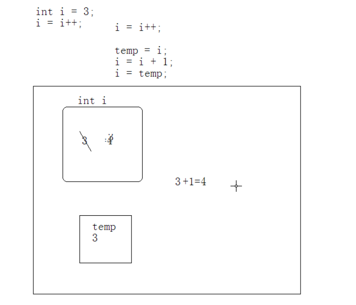

- ## 1、byte和bit区别？
  collapsed:: true
	- byte（字节）：1Byte = 8Bit
		- 是计算机中常用的单位，由8个位组成
	- bit（比特位）：
		- 1、是[[#red]]==**计算机中最小的单位，**==用于表示二进制数据的单个值，可以是0或1
		- 2、比特是数字数据的最基本组成部分，它代表了一个二进制数字的单个状态
- ## 2、常见存储和传输数据的单位
  collapsed:: true
	- B、字节（Byte）：是计算机==**存储和传输数据**==的最小单位，一个字节由8个比特（bit）组成
	- KB、千字节（Kilobyte，KB）：1 KB等于1024字节
	- MB、兆字节（Megabyte，MB）：1 MB等于1024 KB，
	- GB、千兆字节：（Gigabyte，GB）：1 GB等于1024 MB，
- ## 3、基本数据类型占的内存大小？
  collapsed:: true
	- ## 整数：默认int
		- byte（1字节）
			- -128-127
		- short（2字节）
			- 32768-32767
		- int（4字节）
			- -2(31次幂)到2（31次幂）  -1
		- long（8字节）
	- ## 浮点型：默认double
		- float（4字节）
		- double（8字节）
	- ## Boolean
		- boolean（1个字节，8比特位）
	- ## 字符：
		- char（2个字节16位）
- ## 4、ASCII编码表（二进制和字母对应表）
  collapsed:: true
	- 小写字母a-z对应二进制和十进制(97-122)表格
	  collapsed:: true
		- | 字母 | 二进制 | 十进制 |
		  | ---- | ---- | ---- |
		  | a | 01100001 | 97 |
		  | b | 01100010 | 98 |
		  | c | 01100011 | 99 |
		  | d | 01100100 | 100 |
		  | e | 01100101 | 101 |
		  | f | 01100110 | 102 |
		  | g | 01100111 | 103 |
		  | h | 01101000 | 104 |
		  | i | 01101001 | 105 |
		  | j | 01101010 | 106 |
		  | k | 01101011 | 107 |
		  | l | 01101100 | 108 |
		  | m | 01101101 | 109 |
		  | n | 01101110 | 110 |
		  | o | 01101111 | 111 |
		  | p | 01110000 | 112 |
		  | q | 01110001 | 113 |
		  | r | 01110010 | 114 |
		  | s | 01110011 | 115 |
		  | t | 01110100 | 116 |
		  | u | 01110101 | 117 |
		  | v | 01110110 | 118 |
		  | w | 01110111 | 119 |
		  | x | 01111000 | 120 |
		  | y | 01111001 | 121 |
		  | z | 01111010 | 122 |
	- 大写字母 A-Z 对应的二进制和十进制(65-90)表示的表格：
	  collapsed:: true
		- | 字母 | 二进制 | 十进制 |
		  | ---- | ---- | ---- |
		  | A | 01000001 | 65 |
		  | B | 01000010 | 66 |
		  | C | 01000011 | 67 |
		  | D | 01000100 | 68 |
		  | E | 01000101 | 69 |
		  | F | 01000110 | 70 |
		  | G | 01000111 | 71 |
		  | H | 01001000 | 72 |
		  | I | 01001001 | 73 |
		  | J | 01001010 | 74 |
		  | K | 01001011 | 75 |
		  | L | 01001100 | 76 |
		  | M | 01001101 | 77 |
		  | N | 01001110 | 78 |
		  | O | 01001111 | 79 |
		  | P | 01010000 | 80 |
		  | Q | 01010001 | 81 |
		  | R | 01010010 | 82 |
		  | S | 01010011 | 83 |
		  | T | 01010100 | 84 |
		  | U | 01010101 | 85 |
		  | V | 01010110 | 86 |
		  | W | 01010111 | 87 |
		  | X | 01011000 | 88 |
		  | Y | 01011001 | 89 |
		  | Z | 01011010 | 90 |
	- ## 由编码表可知 字母（换算成对应二进制）可与数字运算
		- ‘a’+1 = 97+1 = 98。对应编码表‘b’
- ## 5、自增运算符：i++和++i
  collapsed:: true
	- 1、如果是单纯的i++ 或者 ++i 放前边 放后边都没关系
	- 2、如果++参与了运算比如 b = i++
		- ```java
		  int i = 3,b;
		  b = i++
		  ```
		- ++放后边，并且参与了运算，实际上在赋值b之前，每次先将i = 3存个临时变量。用于b的赋值运算。
			- 所以b= 3 i = 4
	- 3、再比如 i = i++   i = 3
		- 先存临时变量 temp = 3
		- i++ = 4赋值给i
		- i = temp 【此时是i=i的赋值运算，只不过赋值的是i在运算前存的临时变量】
		- 
- ## 6、赋值运算符：+=，-=，*=，/=
  collapsed:: true
	- 面试题
		- ```java
		  // 整数里默认都是int的  右边是3 int型的，赋值给short会判断常量能不能装下
		  // 能装下会去掉int高位，保留低位，能放入short的【进行转型】
		  short s = 3;
		  // 也是赋值运算符，相当于一次运算。这个不会报错
		  s+=4
		  
		  // 2次运算，相当于变量用于short的运算，short不能判断变量的范围，所以会报错损失精度  
		  s = s + 4  
		  ```
- # 面试题
  collapsed:: true
	- ## 1、byte或者short同类型计算：常量计算和变量计算
		- 常量可以计算：
		- ```java
		  byte b = 4
		  // byte常量可以计算，byte范围 -128 到 127  
		  b = 3 + 7   
		  ```
		- [[#red]]==**变量计算：不允许计算**==，因为byte检查是否超范围，检查不出变量，值不确定，所以不让加
		- ```java
		  byte b1 = 3;
		  byte b2 = 7;
		  b = byte1 + byte2
		  ```
	- ## 2、Int可以计算自身和byte/short类型的变量
		- 1、首先**默认整数都是int**类型的。int类型的变量运算 还是int
		- 2、byte类型的运算即使再大也超不出int，所以范围可控
	- ## 3、+=赋值运算和 s = s+4 运算后赋值的区别？
		- 1、虽然s+=4 理解上是先s+4再赋值给s。但是实际上赋值运算符 进行的是一次针对常量4的运算
		- 2、而s = s + 4 是先进行变量s和常量4的运算。再赋值s，是二次运算
		- ```java
		  // 整数里默认都是int的  右边是3 int型的，赋值给short会判断常量能不能装下
		  // 能装下会去掉int高位，保留低位，能放入short的【进行转型】
		  short s = 3;
		  // 也是赋值运算符，相当于一次运算。这个不会报错
		  s+=4
		  
		  // 2次运算，相当于变量用于short的运算，short不能判断变量的范围，所以会报错损失精度  
		  s = s + 4  
		  ```