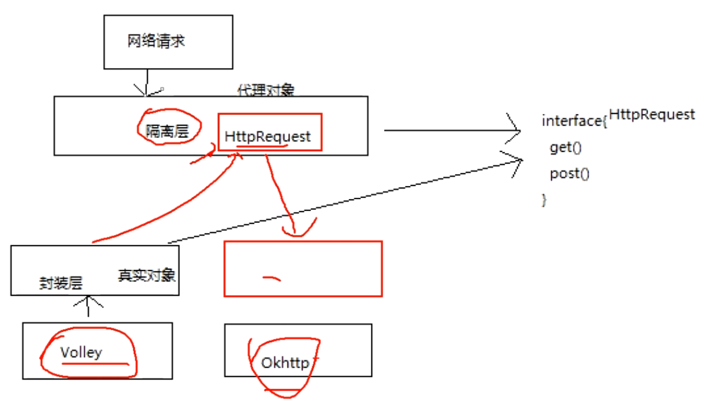

- ## 一、工厂方法模式和抽象工厂模式的区别
  collapsed:: true
	- 工厂方法模式
		- [[#red]]==**一个抽象产品类**==，可以派生出[[#red]]==**多个相同类型的具体产品类**==。
		- 一个抽象工厂类，可以派生出多个具体工厂类。
		- 每个具体工厂类只能创建一个具体产品类的实例。
	- 抽象工厂模式
		- 多个抽象产品类，每个抽象产品类可以派生出多个具体产品类。
		- 一个抽象工厂类，可以派生出多个具体工厂类。
		- 每个具体工厂类可以创建多个具体产品类的实例。
	- 区别
		- 1、工厂方法模式只有一个抽象产品类，而抽象工厂模式有多个
		- 2、工厂方法模式的具体工厂类只能创建一个具体产品类的实例，而抽象工厂模式可以创建多个不同的具体产品类实例
		- 3、工厂方法是由子类自行决定实例化那个类，而抽象工厂是自己决定实例化哪个类
		-
- ## 二、[[实际使用过]]的设计模式
- ## 三、代理模式面试题
	- ### 1、[[静态代理动态代理的区别？]]
	- ### 5、[[静态代理和动态代理的优缺点？]]
	- ### 2、[[jdk动态代理和CGLIB动态代理的区别]]
	- ### 3、代理面试使用场景？
	  collapsed:: true
		- 3-1、静态代理-API差异化 也是隔离层
		- 3-2、动态代理-Retrofit,AOP编程
		- 3-3、hook
		- 3-4、比如网络请求的隔离层，防止更换底层框架，更改跟多处代码
		  collapsed:: true
			- 隔离层就是代理接口
			- 
	- ### 4、[[动态代理原理(反射)]]
	- ### 5、为什么动态代理只能代理接口？
		- 因为生成的代理类，实现了我们代理接口 继承了Proxy类。java单继承，也就决定了只能代理接口了
- ## 四、建造者模式面试题
	- ### 1、[[什么时候使用建造者模式？]]