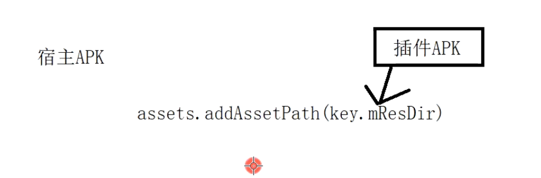
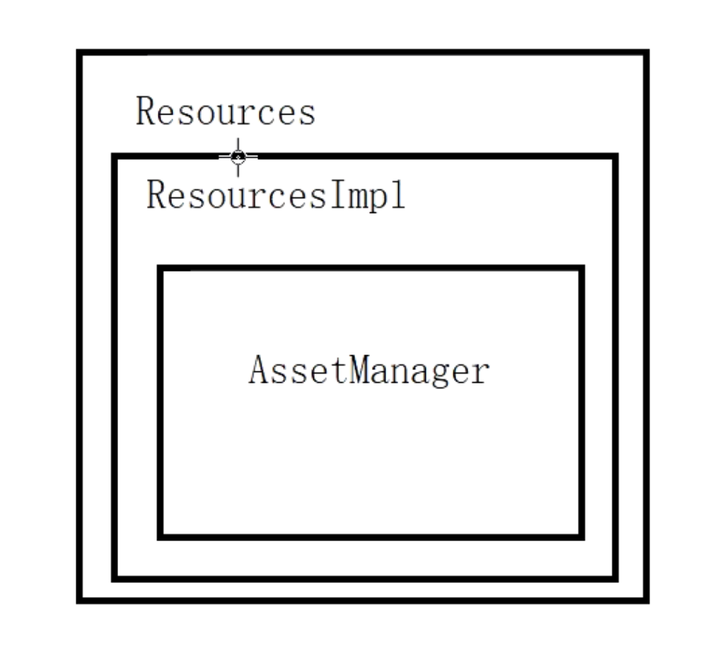

## 入口函数ActivityThread handleBindApplication
	- 1、创建mInstrumentation = new Instrumentation();
	- 2、初始化Appliction
		- ```
		  app = data.info.makeApplication(data.restrictedBackupMode, **null**);
		  ```
	- 3、通过Instrumentation调用Application的onCreate
		- ```java
		  mInstrumentation.callApplicationOnCreate(app);
		  ```
- ## LoadedApk.java  makeApplication继续application的初始化
  collapsed:: true
	- ## makeApplication
		- 1、创建APPlication  的 Context
		  id:: 64cc580d-cf70-439f-8e9e-7f9eaf7597c7
			- 982  ContextImpl appContext = ContextImpl.createAppContext(mActivityThread, this);
- ## ContextImpl
  collapsed:: true
	- ## createAppContext
		- 1、new  ContextImpl(实际 new  application  上下文)
		- 2、从apk里加载资源
			- ```java
			  context.setResources(packageInfo.getResources());
			  ```
- ## LoadedApk.getResources
  collapsed:: true
	- mResources = ResourcesManager.getInstance().getResources(。。。）
- ## ResourcesManager的getResources
  collapsed:: true
	- ```java
	  return getOrCreateResources(activityToken, key, classLoader);
	  ```
- ## ResourcesManager。getOrCreateResources
  collapsed:: true
	- 1、如果已经缓存就 ResourcesImpl resourcesImpl = findResourcesImplForKeyLocked(key);
	- 2、创建资源636  ResourcesImpl resourcesImpl = createResourcesImpl(key);
- ## ResourcesManager。createResourcesImpl
  collapsed:: true
	- 338  final AssetManager assets = createAssetManager(key);
- ## ResourcesManager.createAssetManager
  collapsed:: true
	- ```
	  279  assets.addAssetPath(key.mResDir)  
	  该方法内调用native方法完成资源加载
	  ```
	- > 就是把apk加载以后，调用Native 方法，实现 资源文件路径的加载，就是生成resources.arsc 二进制文件
- # 看了流程之后总结
  collapsed:: true
	- 
	- addAssetPath 方法传入apk路径，生成对应path的 resources.arsc 二进制文件。
	- 我们传入插件apk，那么读出来的就是插件里的资源
- # resource结构
  collapsed:: true
	- 
	- 例子1：getResources().getColor()，最终通过AssetManager 去从resources.arsc 找资源名字和文件的映射，再通过io加载
	-
- # [[AssetManager中重要的API]]
- ## [[AndroidResource资源加载流程]]