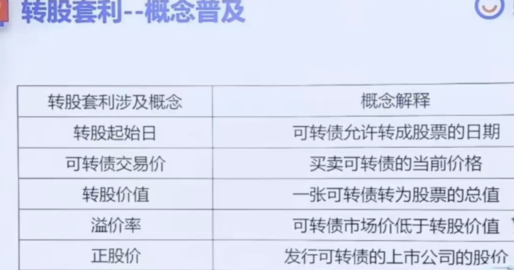

- # 一、概念
  collapsed:: true
	- {:height 401, :width 746}
- # 二、 前提条件
	- 1、转股期内
	- 2、溢价率为负  [一定转债价格 小于  转股价值]   -3%以下更稳
	- 溢价率 = (转债价格-转股价值)/转股价值
	- 3、选择当天正股涨停的(第二天接着涨的可能性大)
		- 集思录  看正股涨跌排序，，可以看到涨停的
	- 4、看一下尾盘封单量，封单量越大越好(封单量是涨停后，还在排队买进的人)
	- 5、选择优质好公司(省的被套)
- # 三、卖出
	- 转股后的第二天开盘才能卖出
	- 1、正股继续涨---> 必然盈利
	- 2、正股不涨不跌---> 必然盈利
	- 3、正股下跌 ----> 可能保本、微赚、也可能亏损
- # 四、转股数量的计算
	- (100元*可转债的持有数量）/转股价
	- 转股数量必须是整数
	- 不足一股的部分会折合为现金返回账户
- # 转股价值的计算
	- 转股价值= (100/转股价）*当前的正股价
- # 五、转股方法
	- 1、涨乐财富通 其他交易
	- 2、找到债转股
	- 3、输入转股代码和数量
		- 转股代码：输入的是可转债页面上写的转股代码