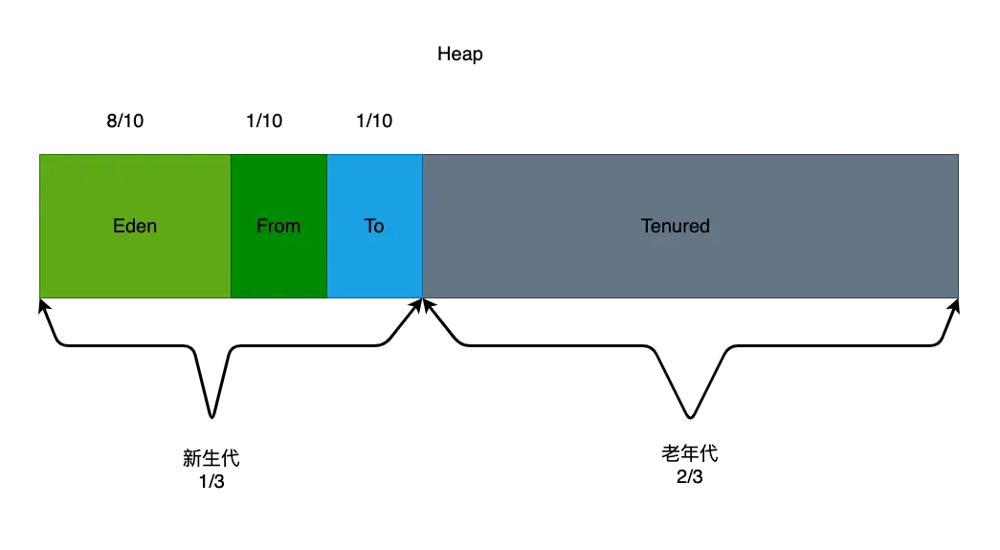

- # 一、简介
	- [[#red]]==**堆空间是连续的**==
	- 对于绝大多数应用来说，java堆这块区域是 JVM 所管理的内存中最大的一块，也是垃圾收集的主要区域，[[#red]]==**主要存放对象实例和数组(数组也是new出来的对象)**==。
- # 二、java堆的大小参数设置
	- -Xmx 堆区内存可被分配的最大上限
	- -Xms 堆区内存初始内存分配的大小
	- JVM中通过-Xms参数设置堆的初始值，-Xmx设置堆的最大值。
		- Android 一般国内的手机厂商都会做修改, 根据手机配置不同而不同，保存在System/build.prop文件中.
		- ```
		   //App启动后，系统分配给它的堆初始大小，随着App使用可增加。
		   dalvik.vm.heapstartsize
		  
		   //默认情况下, App可使用的堆的最大值, 超过这个值就会产生OOM.
		   dalvik.vm.heapgrowthlimit
		  
		  //如果App的manifest文件中配置了largeHeap属性, 那么App可使用的堆最大值为此项设定值。
		  dalvik.vm.heapsiz
		  ```
- # 三、分代收集算法
	- 由于现代虚拟机采用[[#red]]==**分代收集算法**==，Java堆从GC的角度还可以细分新生代和老年代，新生代又分Eden区、From Survivor区和To Survivor区。进一步划分的目的是为了更好地回收内存，或者更快地分配内存
	- 
	- 大部分情况，==对象都会首先在 Eden 区域分配==，在一次新生代垃圾回收后，如果对象还存活，则会进入 From区 或者 To区，并且对象的年龄还会加 1，之后每进行一次垃圾回收，它的年龄就加一，在From区 和 To区之间来回倒腾，当它的年龄增加到一定程度（默认为 15 次），就会被晋升到老年代中。
	- 对象晋升到老年代的年龄阈值，可以通过参数 -XX:MaxTenuringThreshold 来设置。堆可以不需要连续内存（现在堆内存的结构可能是一块块的堆内存通过链表连接起来，哪块需要回收就回收哪块），并且可以动态增加其内存，但如果超出了最大内存，增加失败或者新对象无法分配到内存会抛出 OutOfMemoryError 异常。