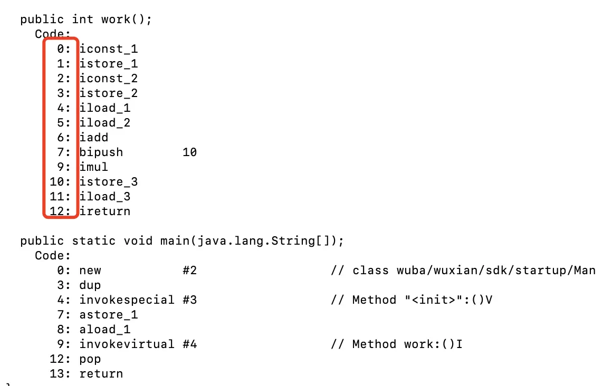
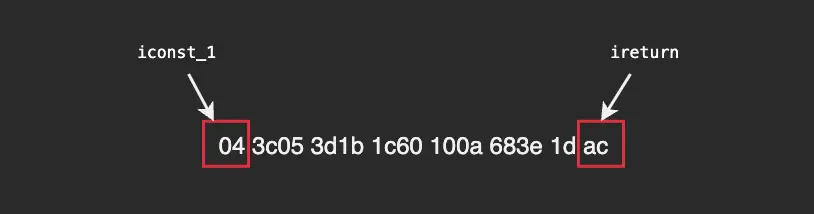

- # 一、概念
	- 在 JVM 规范中，[[#red]]==**每个线程都有它自己的程序计数器，他的生命周期与线程的生命周期是一致的**==。
	- [[#red]]==**程序计数器会存储当前线程正在执行的 Java 方法的 JVM 指令偏移地址**==,字节码解释器工作时就是通过改变这个计数器的值来选取下一条需要执行的字节码指令。
	- 我们知道在[[#red]]==**多线程程序中cpu为每个线程分配了时间片**==，时间到了就会切到下一个线程，直到重新获取时间片，[[#red]]==**程序计数器就能让cpu知道上次执行到哪了**==。
	- 程序计数器在虚拟机内存中是一块[[#red]]==**很小的内存空间，几乎可以忽略不记,**==也是运行速度最快的存储区域。是[[#red]]==**唯一一个不会 OutOfMemoryError 的区域**==
- # 二、例子：
	- ```java
	  public class Man {
	      public Man() {
	      }
	  
	      public int work() {
	          int x = 1;
	          int y = 2;
	          int z = (x + y) * 10;
	          return z;
	      }
	  
	      public static void main(String[] args) {
	          Man man = new Man();
	          man.work();
	      }
	  }
	  
	  ```
	- 通过javap反编译字节码发现在[[#red]]==**字节码的左边有一个行号标识，它其实就是指令的偏移地址**==。
		- 
	- 在字节码code里，指令iconst_1对应的字节码是“04”，ireturn是“ac”，每个指令占两位，iconst_1、ireturn对应的位置就是0、12，与上面标记的是一致的。
	- work()方法的原始字节码
		- 
	-