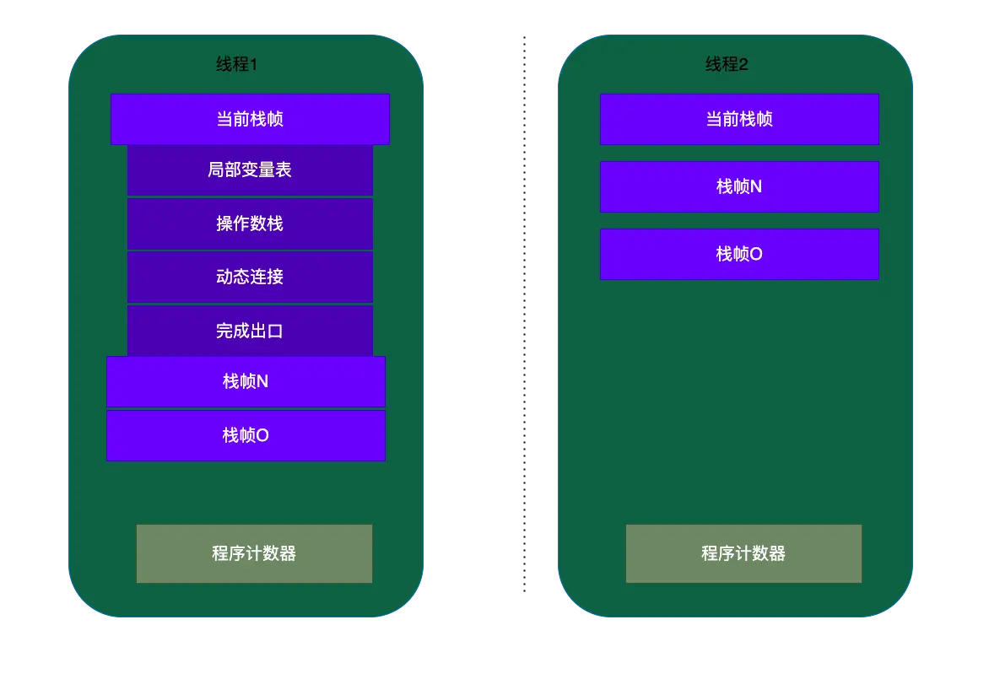
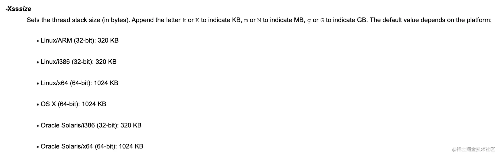

- # 一、概念
	- [[#red]]==**虚拟机栈是存储当前线程运行方法所需的数据、指令、返回地址的一个栈结构，每个线程都对应一个虚拟机栈**==。
	- **[[#red]]==方法每调用一次就会创建一个栈帧入虚拟机栈，执行完出栈，出栈后栈中的所有对象都会被释放==**。
- # 二、虚拟机栈结构：
	- 每个线程的虚拟机栈都可能有多个栈帧，栈帧又包含局部变量表、操作数栈、动态链接和完成出口。
	  collapsed:: true
		- 
	- ## 2.1 局部变量表
		- [[#red]]==**局部变量表用于存放方法参数和方法内部定义的局部变量**==，只能[[#red]]==**存储8大基本数据类型和对象引用**==。
		- 局部变量表中的变量只能在当前方法调用中有效。
		- 当方法调用结束时，局部变量表也会随之销毁，局部变量表中的变量是重要的垃圾回收对象。
	- ## 2.2 操作数栈
	  collapsed:: true
		- 在方法的执行过程中，[[#red]]==**存放方法的执行和操作**==，会有各种字节码指令往操作数栈中写入和读取内容。操作数栈的每个元素可以是任意Java数据类型
		- 以上面Man的work方法为例，我们来翻译一下字节码
		  参考JVM字节码指令集 https://cloud.tencent.com/developer/article/1333540
		- {:height 382, :width 514}
		- ```
		  - 0: iconst_1     int 1 入操作数栈  （变量 x）
		      
		    1: istore_1     int 1 从操作数栈出栈存入局部变量表（下标位置：1）
		  - 2: iconst_2     int 2 入操作数栈 （变量 y）
		  - 3: istore_2     int 2 从操作数栈出栈存入局部变量表（下标位置：2）
		  - 4: iload_1      局部变量表下标位置为1的变量入操作数栈（变量x）
		  - 5: iload_2      局部变量表下标位置为2的变量入操作数栈（变量y）
		      
		    6: iadd         加法运行 x+y，结果入操作数栈
		  - 7: bipush 10    int 10 入操作数栈
		  - 9: imul         乘法运算 结果入操作数栈
		  - 10: istore_3    加法运算结果存人局部变量表（下标位置：3）
		  - 11: iload_3     局部变量表下标位置为3的变量入操作数栈
		  ```
		- 模型图：
			- 
		- 上面看到字节码指令的执行就是操作数栈不断的入栈出栈。
		- ### [[操作数栈与寄存器]]
	- ## 2.3 动态链接：
	  collapsed:: true
		- 官方解释看完还是不知道说的啥，说下我自己的理解。[[#red]]==**java语言是多态的**==，Animal 有两个子类Cat、Dog，他们都有run（）方法，下面的一段代码
			- ```
			  Animal an = name.equel("miaomiao")?new Cat: new Dog();
			  an.run();
			  ```
		- [[#red]]==**编译器编译的时候**==并[[#red]]==**不知道**==run（）[[#red]]==**方法是Cat还是Dog**==，要在[[#red]]==**具体执行的时候才能够确定**==，需要通过[[#red]]==**动态链接握持的指针来具体的确定。**==
		-
	- ## 2.4 完成出口（返回地址）
	  collapsed:: true
		- 在一个[[#red]]==**栈帧执行完方法退出后都需要返回到方法被调用的位置，程序才能继续执行**==。方法返回时还可能需要在当前栈帧中保存一些信息，用来帮他恢复它的上层方法执行状态。[[#red]]==**记录的方法返回的地址就是方法的完成出口或者叫返回地址。**==
- # 三、虚拟机栈的大小
	- 虚拟机栈的内存大小也是有限制的，不同平台大小限制不同，[[#red]]==**一般通过"-Xss"参数控制**==。在JDK1.4中默认是256k，而在JDK1.5+默认是1M。
	- 
	- 如果当前线程请求的栈深度大于虚拟机所允许的最大深度，将抛出StackOverFlowError。
	- 每起一个线程就会创建一个虚拟机栈，假如每个栈大小1M，1000个线程就需要1000M内存，如果超出了最大内存，导致无法为新的线程分配内存就会OutOfMemoryError