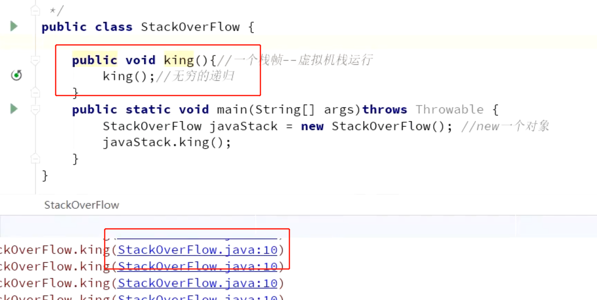
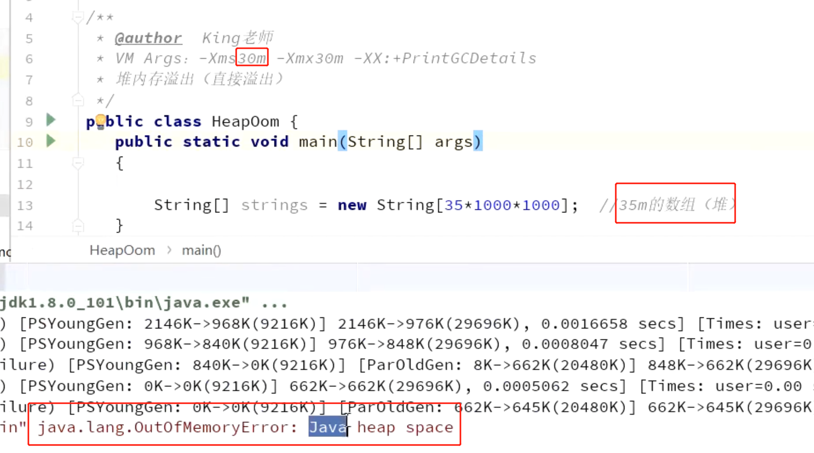
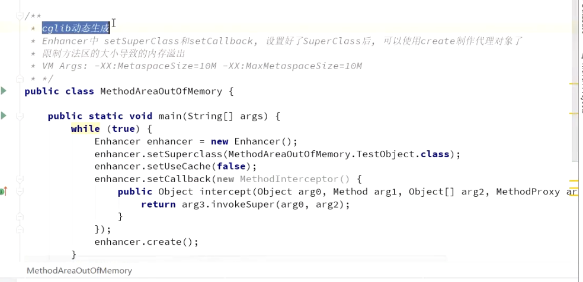

- ## 1. 虚拟机栈和本地方法栈溢出
  collapsed:: true
	- 1、
		- [[#red]]==**不断创建线程**==，如果虚拟机在扩展栈时无法申请到足够的内存空间，则抛出**==OutOfMemoryError异常==**
	- 2、频繁入栈会栈溢出
		- 
- ## 2.堆内存溢出
	- Full GC后，若Survivor及Old区仍然无法存放从Eden复制过来的部分对象，导致JVM无法在Eden区为新对象创建内存区域，则出现outOfMemoryError：java heap space
	- 1、虚拟机设置30M内存，申请35M数组，会oom
		- 
- ## 3.方法区溢出
  collapsed:: true
	- 方法区用于存放Class的相关信息，如果程序加载的类过多，或者使用反射、cglib等这种动态代理生成类的技术，就可能导致该区发生内存溢出。方法区溢出也是一种常见的内存溢出异常，因为类是是很难被垃圾收集器回收的。
	- 1、借助[[cglib]]。不断生成代码
		- 
- ## 4. 直接内存溢出
	- 直接内存溢出受本机总内存的限制，如果内存区域总和大于物理内存限制从而导致动态扩展时出现异常就会报outOfMemoryError。
-