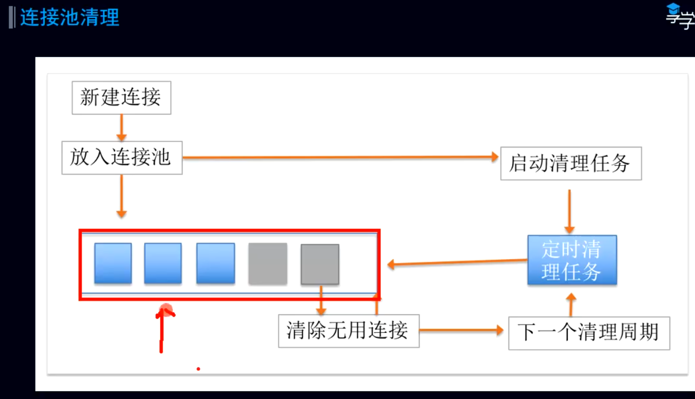

- ## 一、概念
	- 存一些之前建立好的Socket，Socket会和服务器ip/Port绑定
	- 每次请求过来，判断有没有与我要建立链接的服务器，相同的Socket
- ## 二、构造函数：默认多闲置连接是5个，保持时间是5分钟
  collapsed:: true
	- ```java
	    constructor(
	      maxIdleConnections: Int,  // 最大闲置的链接  相当于线程池的核心线程数
	      keepAliveDuration: Long,  //
	      timeUnit: TimeUnit
	    ) : this(RealConnectionPool(
	        taskRunner = TaskRunner.INSTANCE,
	        maxIdleConnections = maxIdleConnections,
	        keepAliveDuration = keepAliveDuration,
	        timeUnit = timeUnit
	    )) 
	      
	  // 默认连接池的配置    
	  constructor() : this(5, 5, TimeUnit.MINUTES)
	  ```
	- maxIdleConnections: Int,  // 最大闲置的链接  相当于线程池的核心线程数
	- keepAliveDuration: Long,  // 最大保存时间 5分钟
	- timeUnit // 判断为闲置连接的单位  分钟
- ## 三、添加新链接，可以一直加，空闲的超过5个的会被清理
  collapsed:: true
	- RealConnectionPool
	- ```kotlin
	    fun put(connection: RealConnection) {
	      connection.assertThreadHoldsLock()
	      // 添加到链接池 
	      connections.add(connection)
	      // 启动连接池 清理任务
	      cleanupQueue.schedule(cleanupTask)
	    }
	  ```
- ## 清理连接池任务
  collapsed:: true
	- ## 连接池会创建一个线程池，去执行清理任务(和调度器的一样高并发)
		- ```java
		      private val executor = ThreadPoolExecutor(
		          0, // corePoolSize.
		          Int.MAX_VALUE, // maximumPoolSize.
		          60L, TimeUnit.SECONDS, // keepAliveTime.
		          SynchronousQueue(),
		          threadFactory
		      )
		  ```
	- ## 连接池的清理
	  collapsed:: true
		- 
		-
	- ```kotlin
	    private val cleanupTask = object : Task("$okHttpName ConnectionPool") {
	      override fun runOnce() = cleanup(System.nanoTime())
	    }
	  ```
	- cleanup
	  collapsed:: true
		- ```java
		   fun cleanup(now: Long): Long {
		      var inUseConnectionCount = 0
		      var idleConnectionCount = 0
		      var longestIdleConnection: RealConnection? = null
		      var longestIdleDurationNs = Long.MIN_VALUE
		  
		      // 查找要清除的连接，或下一次清除到期的时间
		      for (connection in connections) {
		        synchronized(connection) {
		          // 检测链接是否在用
		          if (pruneAndGetAllocationCount(connection, now) > 0) {
		            inUseConnectionCount++ // 记录在用的链接数
		          } else {
		            idleConnectionCount++ // 记录闲置的链接数
		  
		            // 获得这个链接闲置时间，遍历完 拿到闲置最久的
		            val idleDurationNs = now - connection.idleAtNs
		            if (idleDurationNs > longestIdleDurationNs) {
		              longestIdleDurationNs = idleDurationNs
		              longestIdleConnection = connection
		            } else {
		              Unit
		            }
		          }
		        }
		      }
		  
		      when {
		        // 超过了保活时间，或者池内数量超过5个 马上移除，然后返回0 表示不等待，维持5个以内
		        longestIdleDurationNs >= this.keepAliveDurationNs
		            || idleConnectionCount > this.maxIdleConnections -> {
		          // We've chosen a connection to evict. Confirm it's still okay to be evict, then close it.
		          val connection = longestIdleConnection!!
		          synchronized(connection) {
		            if (connection.calls.isNotEmpty()) return 0L // No longer idle.
		            if (connection.idleAtNs + longestIdleDurationNs != now) return 0L // No longer oldest.
		            connection.noNewExchanges = true
		            connections.remove(longestIdleConnection)
		          }
		  
		          connection.socket().closeQuietly()
		          if (connections.isEmpty()) cleanupQueue.cancelAll()
		  
		          // Clean up again immediately.
		          return 0L
		        }
		  
		        idleConnectionCount > 0 -> {
		          // A connection will be ready to evict soon.
		          return keepAliveDurationNs - longestIdleDurationNs
		        }
		  
		        inUseConnectionCount > 0 -> {
		          // All connections are in use. It'll be at least the keep alive duration 'til we run
		          // again.
		          return keepAliveDurationNs
		        }
		  
		        else -> {
		          // No connections, idle or in use.
		          return -1
		        }
		      }
		    }
		  ```
	- ## 总结
		- 1、遍历连接池，找到闲置时间最久的链接
		- 2、判断是否超过了保活时间 || 池内闲置数量超过5个 马上移除
- ## 四、从连接池取链接，需要判断是否能复用
	- 如果在连接池中找到个连接参数一致并且未被关闭没被占用的连接，则可以复用
	- [[callAcquirePooledConnection]]
	-