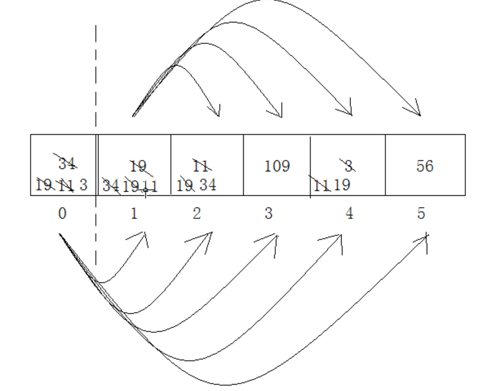

# 思路
	- 每次通过从无序的数组中选择出一个最小的（要求升序排列）数把他放到数组的最前面。
	- 再依次找次小的数字放到数组无序区的最前。直到数组为有序。
	- 
- # 2遍循环嵌套
	- ```java
	      public int[] selectSort(int[] arr) {
	          // 0 挨个和0以后的对比，将最小的放在0位置
	          // 1 挨个和1以后的对比，将最小的放在1位置
	          for (int i = 0; i < arr.length-1; i++) {
	              for (int j = i + 1; j < arr.length; j++) {
	                  if (arr[i] > arr[j]) {
	                      swap(arr, i, j);
	                  }
	              }
	          }
	          return arr;
	      }
	  
	      public void swap(int[] aar, int i, int j) {
	          int temp = aar[i];
	          aar[i] = aar[j];
	          aar[j] = temp;
	      }
	  
	  ```
- # 优化：
	- 因为会每次都交换，操作内存，我们可以记录最小值的值和下标
	- 循环一次后，找到最小值和下标，在和i交换
	- ```java
	    public int[] selectSort(int[] arr) {
	          // 0 挨个和0以后的对比，将最小的放在0位置
	          // 1 挨个和1以后的对比，将最小的放在1位置
	          for (int i = 0; i < arr.length-1; i++) {
	            	// 每次
	            	int num = aar[i];
	            	int index = i;
	              for (int j = i + 1; j < arr.length; j++) {
	                  if (arr[i] > arr[j]) {
	                      num = arr[j];
	                      index = j;  
	                  }
	              }
	            	if(index != x) swap(arr,x,index);
	          }
	          return arr;
	      }
	  
	      public void swap(int[] aar, int i, int j) {
	          int temp = aar[i];
	          aar[i] = aar[j];
	          aar[j] = temp;
	      }
	  
	  ```