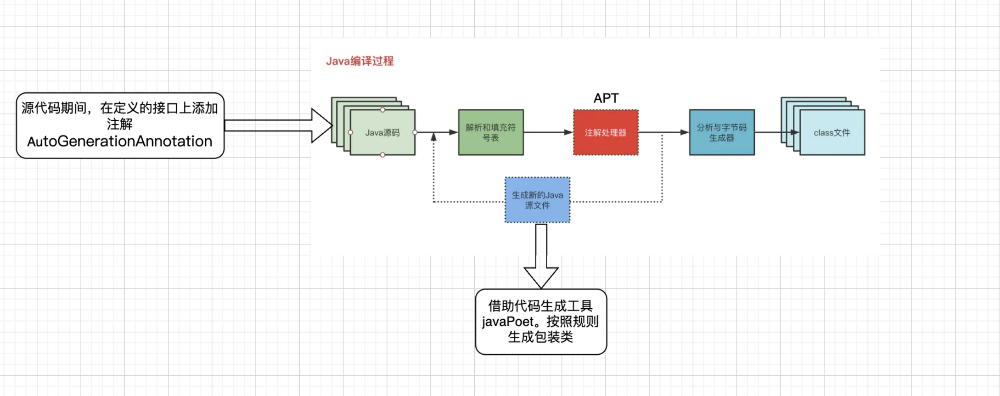
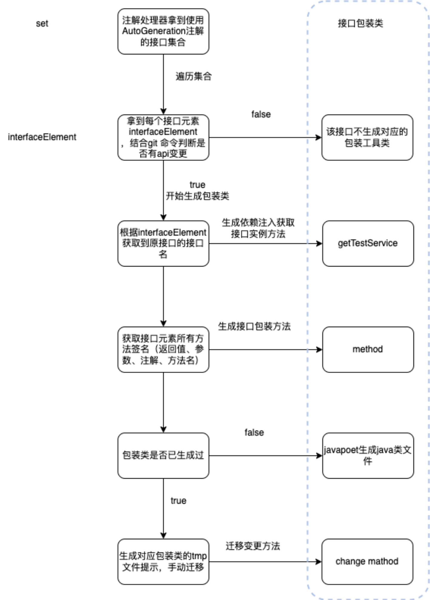

- ## 1、结合程序的编译和执行过程，说明怎样添加注解、添加什么样的注解可以实现自动生成代码、编译器怎样根据注解自动生成代码。
  collapsed:: true
	- {:height 304, :width 746}
	- 具体生成代码工具怎样生成代码：
	  collapsed:: true
		- 
	-
- ## 2、结合程序的编译和执行过程，说明在哪里添加注解、添加什么样的注解可以实现自动生成代码，且即使换内部依赖注入框架，也不影响上层API的调用。（即结合程序的编译和执行过程，说明接口包装工具类的作用、生成方法、使用方法）
	- 前提条件，旧方案和本次优化方法涉及地方
	- 定位库举例：
		- 1、定义定位接口：
			- ```kotlin
			  @MetaXApi(router = DemoRouters.LOCATION_SERVICE)
			  interface ILocationService {
			      fun startLocation(context: Context, callback: LocationCallback)
			      fun stopLocation(context: Context)
			  }
			  ```
		- 2、接口实现类：
		  collapsed:: true
			- ```kotlin
			  // MetaXRoute为路由框架的注解，不是本方法添加的，但是路由通用框架都是这样定义的
			  // 定义的路由标记，怎么在程序中找到他
			  @MetaXRoute(DemoRouters.LOCATION_SERVICE) 
			  class LocationServiceImpl : ILocationService {
			      override fun startLocation(context: Context, callback: LocationCallback) {
			          val location = Location()
			          location.latitude = 31.225
			          location.longitude = 160.551
			          location.locationText = "北京市"
			          callback.onCallback(location)
			      }
			  
			      override fun stopLocation(context: Context) {
			          Toast.makeText(context, "停止定位成功", Toast.LENGTH_LONG).show()
			      }
			  }
			  ```
	- 分享库、或者其他业务库使用
		- 旧方式1、直接通过路由框架获取 定位实现类实例，不进行包装，直接调用，后期换路由框架、或者换定位具体实现，需要修改成本较大
			- ```java
			  MetaXRouteCore这个是路由框架  ApiRouter 这个是路由标记  LocationServiceImpl  通过路由创建的对象
			  // 1、获取实例
			  LocationServiceImpl  impl =  MetaXRouteCore.navigation(ApiRouter)
			  // 2、调用方法
			  impl .startLocation()
			  impl .stopLocation()
			  ```
		- 缺点：很多库使用后，换MetaXRouteCore 路由框架 或者换实现类(换路由 ApiRouter)都是需要外部库更改 和测试的
		- 旧方式2、对方式一进行改造，将实现类对象创建方法调用，都收敛于定位SDK内部，提供一个包装方法
			- 对外提供接口包装工具类，内部创建对应定位对象，包装接口同名的定位方法，供外部调用
			- ```java
			  public class LocationServiceUtils {
			    private static final String ApiRouter = "/demo/locationService";
			  
			    private static ILocationService locationService;
			  
			    public static synchronized ILocationService getLocationService() {
			      if (locationService != null) {
			        return locationService;
			      }
			      Object object = MetaXRouteCore.navigation(ApiRouter);
			      if (object instanceof ILocationService) {
			        locationService = (ILocationService) object;
			      }
			      return locationService;
			    }
			  
			    public static void startLocation(Context context, LocationCallback callback) {
			      ILocationService locationService = getLocationService();
			      if (locationService != null) {
			        locationService.startLocation(context,callback);
			      }
			    }
			  
			    public static void stopLocation(Context context) {
			      ILocationService locationService = getLocationService();
			      if (locationService != null) {
			        locationService.stopLocation(context);
			      }
			    }
			  }
			  ```
		- 外部使用：无论是分享库还是业务库 都这么调用
			- ```java
			  // 直接调用和传参数就行了。具体内部使用的哪个路由框架 也不用关系。内部换了 也不影响这个方法调用
			  LocationServiceUtils.startLocation(Context context, LocationCallback callback) 
			  ```
			-
		- 缺点：这个方案是大多数现在使用的。但是大量接口的话，需要手写很多模板代码。因为每个这个对外工具类提供的功能是一样的
			- 功能1、