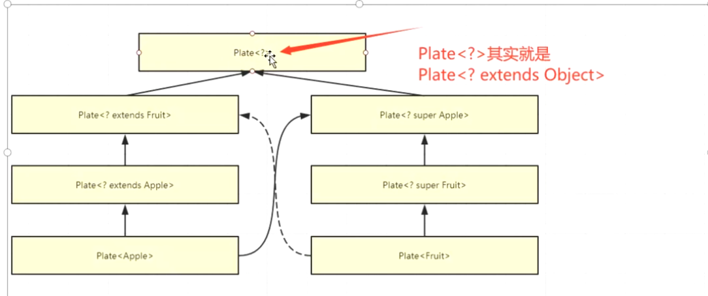

## 概念
	- ? 代表未知类型，**我在泛型实例化的时候，扩大实例的类型的范围**
- ## 1、 ？(通配符)和泛型T有什么关系，和区别
	- 通配符让泛型的转型，更灵活
	- ## 区别
		- T泛型能代表一个类型，用于T t来接收并操作,T 实例化的时候.一旦确定了  就只能操作指定类的数据
		- ？并不需要实例化，，是什么都可以 它只是个占位符
- ## 1背景： 由于六中的面试题得知，List 和 类是不变的，数组才是协变的，那么怎么让Plate<Apple>  变成 Plate<Fruit>盘子，类没协变非继承关系，不能强转，所以可以借助通配符
  collapsed:: true
	- ```java
	  public Plate<? extends Fruit> getSnack(Plate<Apple> applePlate){
	        // applePlate.set(new Banana()); // 想用放苹果的盘子 放香蕉肯定报错
	        // 但是现实中装苹果的盘子也能装香蕉和其他水果，，类没有继承关系强转也不行，就需要借助通配符？
	        // Plate<Fruit> fruitPlate = (Plate<Fruit>)applePlate;
	        
	        Plate<? extends Fruit> fruitPlate = applePlate;
	        return fruitPlate;
	  }
	  ```
- ## 2、[[上界通配符<? extends T>]]
- ## 3、[[下界通配符<? super T>]]
- ## 4、非限定的通配符 Plate<?> 其实就是 Plate<? extends Object>
  collapsed:: true
	- 无限定的通配符，没有extends 和 super，只是一个？
	- 作用：既不能读也不能写，只做类型检查
- ## 5、通配符继承规则
  collapsed:: true
	- 
- ## 6、通配符PECS (Producer extends  Consumer super)原则
  collapsed:: true
	- ### 如果只从集合中获取类型T，使用<? extends T> 通配符，即Producer extends  [[#red]]==**从生产者取**==
	- ### 如果只需要将类型T存放集合中，使用<？super T>通配符，[[#red]]==**往消费者存**==
	- ### 如果既要存，又要取，则不使用任何通配符
	-
	- ### 为何要用PECS原则 ？
		- 提高API灵活性
	- ### <?> 既不能存也不能取，只有类型检查的作用
	  - ## 7、通配符？使用场景**[[#red]]==[不能定在在类和接口上]==**
	  collapsed:: true
	  - ## 1、方法参数：
	  - 在方法的参数中使用通配符，可以使方法接受更广泛范围的参数类型，从而提高方法的灵活性。通配符可以用于上界通配符或下界通配符，这取决于方法是否需要从参数中读取或写入数据。
	  - ```java
	   // 上界通配符：接受类型为 Number 或 Number 子类的列表
	   public void processList(List<? extends Number> list) {
	       // ...
	   }
	   
	   // 下界通配符：接受类型为 Integer 或 Integer 父类的列表
	   public void addToList(List<? super Integer> list) {
	       // ...
	   }
	   
	   ```
	  - > 注意上边方法参数采用了上下界通配符，标注了能接受的列表。但是方法内部通过这个带有通配符的list 读取 也是有区别的,详细见上述1和2
	  - ## 2、局部变量：
	  collapsed:: true
	  - 在局部变量中使用通配符，可以避免编写冗长的类型声明，并使代码更加简洁。
	  - ```java
	   List<?> list = new ArrayList<>();
	   ```
	  - ## 3、类的成员变量：
	  collapsed:: true
	  - 通配符也可以用于类的成员变量的定义，用于提供更灵活的类型支持。
	  - ```java
	   class Box<T> {
	       private List<? extends T> items;
	   
	       public Box(List<? extends T> items) {
	           this.items = items;
	       }
	   
	       // ...
	   }
	   
	   ```
- # [[#red]]==**注意**==
	- 不能直接定义一个使用通配符 `?` 作为泛型类型参数的类或接口，例如 `class Box<?>` 是不合法的
	- 只能