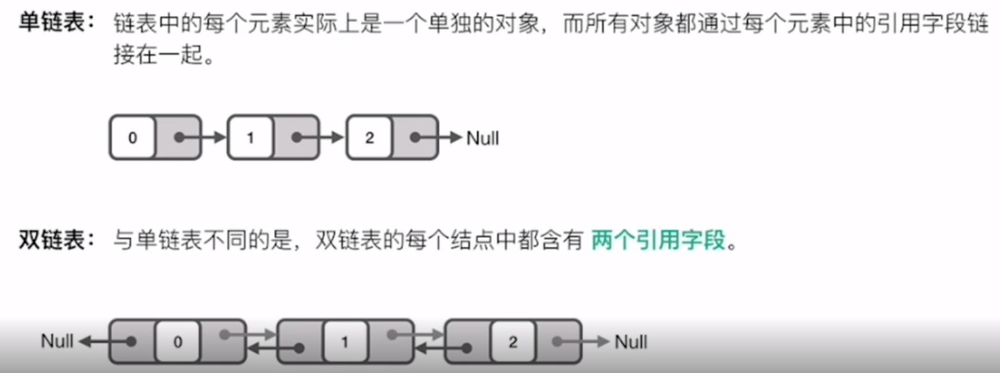

- # 一、概念
  collapsed:: true
	- 
	- 单链表：链表中的每个元素实际上是一个单独的对象，而所有对象都通过每个元素中的引用字段链接在一起。
	- 双链表：与单链表不同的是，双链表的每个结点中都含有两个引用字段。
- # 二、链表的优缺点
	- ## 链表的优点如下：
		- 1、链表能灵活地分配内存空间；
		- 2、能在 O(1) 时间内删除或者添加元素，前提是该元素的前一个元素已知，当然也取决于是单链表还是双链表，在双链表中，如果已知该元素的后一个元素，同样可以在 O(1) 时间内删除或者添加该元素。
	- ## 链表的缺点是：
		- 1、不像数组能通过下标迅速读取元素，每次都要从链表头开始一个一个读取；
		- 2、查询第 k 个元素需要 O(k) 时间。
- # 三、应用场景
	- 如果要解决的问题里面[[#red]]==**需要很多快速查询，链表可能并不适合**==；
	- 如果遇到的问题中，数据的[[#red]]==**元素个数不确定**==，而且需要经常[[#red]]==**进行数据的添加和删除**==，那么链表会比较合适。
	- 而如果数据元**素大小确定**，删除插入的操作并不多，那么数组可能更适合。
	-
- # 四、经典解法
	- ## [[快慢指针]]
	- ## [[构建虚假链表头]]
- # 五、算法题
	- [[206.反转链表（剑指 Offer II 024. 反转链表）-简单]]
	- [[24. 两两交换链表中的节点-中等]]
	- [[25.K个一组翻转链表-困难]]
	- [[剑指 Offer 06. 从尾到头打印链表-简单]]
	- [[剑指 Offer 22. 链表中倒数第k个节点-简单]]
-
-