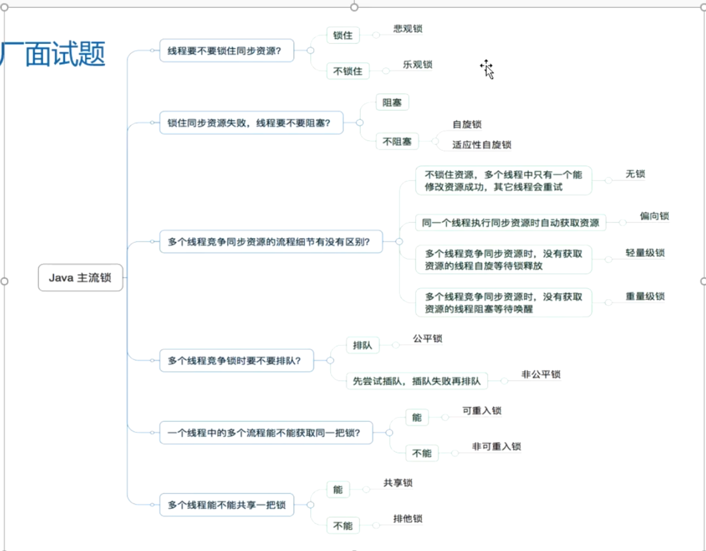

- 图解
  collapsed:: true
	- 
- 1、根据是否手动加锁分为：显示锁lock 和 隐式锁 synced
- 2、线程要不要锁住同步资源：
	- 锁住：悲观锁 lock 和 sych
	- 不锁住：乐观锁，CAS
- 3、锁住同步资源失败，线程要不要阻塞？
	- 阻塞
	- 非阻塞：自旋锁，适应性自旋锁
- 4、多个线程竞争同步资源流程细节有没有区别？
	- 无锁，偏向锁，轻量级锁，重量级锁
- 5、多个线程竞争锁时要不要排队？CLH机制排队拿锁
	- 排队：公平锁
	- 先尝试插队，插队失败再排队：非公平锁
- 6、一个线程中的 多个流程能不能获取同一把锁？
	- 可以：可重入锁
	- 不可以：非可重入锁
- 7、多个线程能不能共享一把锁
	- 能：共享锁：读写锁中的读锁，共享
	- 不能：排他锁（读写锁中的写锁，不允许其他线程读也不允许写）