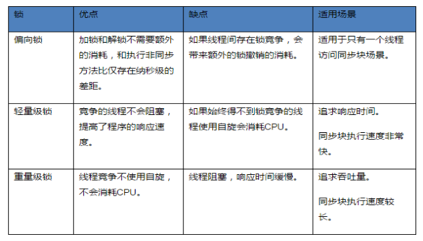

- 一共有四种状态，[[#red]]==**无锁状态，偏向锁状态，轻量级锁状态和重量级锁状态**==，它会随着竞争情况逐渐升级。锁可以升级但不能降级，目的是为了提高获得锁和释放锁的效率。
- ## [[偏向锁]]
- ## [[轻量级锁]]中使用[[自旋锁]]通过CAS操作来加锁和解锁
- ## 重量级锁：
	- 多线程竞争，拿不到锁时，进行上下文切换，进入阻塞态
	- 等待把我唤醒，我再进行上下文切换，切回来
- ## 不同锁的比较
	- 
-