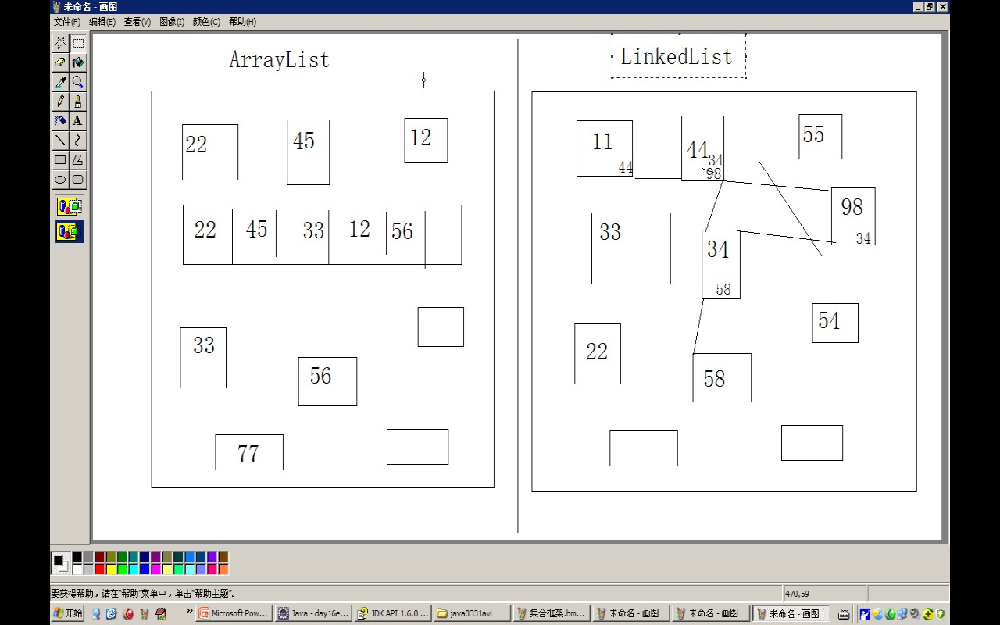
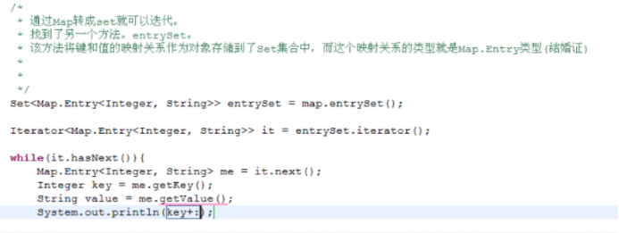
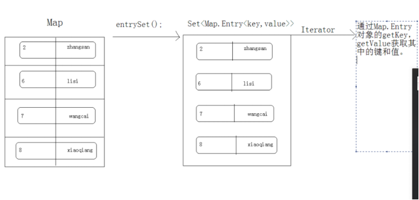
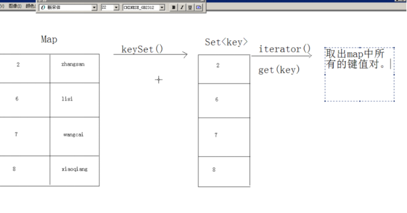
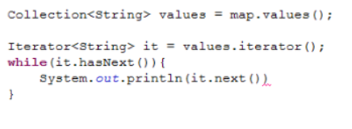
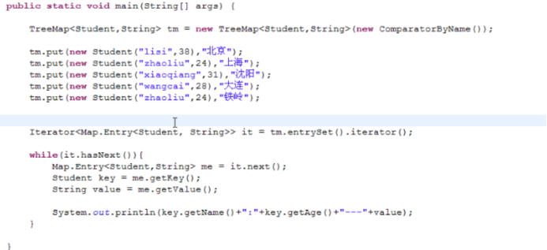

- 
- # 基本概念
	- ## 特点
		- 1，用于存储对象的容器。
		  2，集合的长度是可变的。
		  3，集合中不可以存储基本数据类型值
- # 一、父接口1：Collection
	- ## collection常见方法
	  collapsed:: true
		- 1，添加。
		  	boolean add(Object obj):
		  	boolean addAll(Collection coll):
		- 2，删除。
		  	boolean remove(object obj):
		  	boolean removeAll(Collection coll);
		  	void clear();
		  
		  3，判断：
		  	boolean contains(object obj):
		  	boolean containsAll(Colllection coll);
		  	boolean isEmpty():判断集合中是否有元素。
		- 4，获取：
		  	int size():
		  	Iterator iterator():取出元素的方式：迭代器。
		  	该对象必须依赖于具体容器，因为每一个容器的数据结构都不同。
		  	所以该迭代器对象是在容器中进行内部实现的。
		  	对于使用容器者而言，具体的实现不重要，只要通过容器获取到该实现的迭代器的对象即可，
		  	也就是iterator方法。
		  
		  	Iterator接口就是对所有的Collection容器进行元素取出的公共接口。
		  	其实就是抓娃娃游戏机中的夹子！
		  
		  
		  5，其他：
		  	boolean retainAll(Collection coll);取交集。
		  	Object[] toArray():将集合转成数组。
	- ## [[List子接口]]
		- 特点:
			- 有序（存入和取出的顺序一致），可重复，有索引，可以插任意个 null。实现类有 Stack, Vector, ArrayList, LinkedList。
		- 常用实现类：
			- 
			- ## [[ArrayList]]：（常用）
			- ## [[LinkedList]]：（常用）
			- ## Vector：ArrayList 的线程安全版。，性能差废弃
				- ==**数组**==数据结构，但是长度可以增加缩小；增删，查询都慢
			- ## Stack：栈。
				- 增：push。
				- 删：pop。
				- 改：没有（naidesu 悲）。
				- 查：peek, search。
				- Stack 就这几种方法，没有其他 List 的公用方法。还有一个判断方法 empty。
	- ## [[Set子接口]]
		- 常用方法：
			- isEmpty, contains, iterator, clear, clone, size, hashCode。
		- 特点：
			- 无序，无重复，唯一性，只能插入一个 null。实现类有 HashSet, TreeSet。
			- 增删方法都是 add, remove。没有改查方法
		- 常用实现类：
			- ## [[HashSet]]：基于 HashMap 实现。（常用）
				- ### LinkedHashSet：基于 LinkedHashMap(哈希表和链表) 实现。可以记录插入顺序。不重复
			- ## [[TreeSet]]：基于 TreeMap 实现。红黑树结构（自平衡排序二叉树）。（常用，场景：==对集合自定义排序用==）
			- ## [[HashSet和TreeSet区别]]
	- ## [[Queue子接口]]队列。
	- ##  其他
		- # [[Iterator 接口]]
		- Array和list转换
		  collapsed:: true
			- 数组转换为 List：
			  collapsed:: true
				- ```
				  // Collections.toArray() 用法：
				  Integer[] array = new Integer[list.size()];
				  list.toArray(array); // 用法1：list.toArray(目标数组)
				  array = list.toArray(new Integer[0]); // 用法2：a = list.toArray(new Type[0]) 利用 new Type[0] 转换 Object 类型
				  array = list.toArray((Integer[]) new Object(list.size)) // 用法3：a = list.toArray((Type[]) new Object(list.size())) 利用 (Type[]) 强制类型转换
				  
				  ```
			- List 转换为数组：
				- ```java
				  //Arrays.asList() 用法：
				  Integer[] array = {1, 2, 3}; // 源数组必须为包装类数组
				  List list = Arrays.asList(array); // 用法1：直接调用 Arrays.asList()
				  List list = new ArrayList<>(Arrays.asList(array)); // 用法2：利用 new Type<>() 修改 Arrays.asList 的类型
				  
				  ```
- # 二、父接口2:Map
  collapsed:: true
	- ## 实现类
		- HashMap, TreeMap, HashTable, LinkedHashMap, ConcurrentHahsMap
	- ## 常用方法：
		- 增删改查是 put, remove, replace, get, getOrDefault, containsKey, containsValue。
		- 增：put。
		- 删：remove。
		- 改：replace。
		- 查：get, getOrDefault, containsKey, containsValue。
		- put 和 replace 效果相同，可以多用 put。
		- 其他常用方法：entrySet, keySet, values, isEmpty, contains, iterator, clear, clone, size, hashCode。
	- ## 遍历常用方法：
		- ## EntrySet
		  collapsed:: true
			- {:height 267, :width 687}
			- 
		- ## KeySet
		  collapsed:: true
			- 
		- ## Values
		  collapsed:: true
			- 
	- ## 常用实现类
		- ## HashMap：字典。（常用）
			- 内部结构是hash表，  是[[#red]]==**不同步的**==，允许null值null键
			- ## 子类LinkedHashMap：字典，可以记录插入顺序。
		- ## HashTable：HashMap 的线程安全版。（常用）
			- 内部结构是hash表,[[#red]]==**是同步的**==，不允许null值null键
			- ## 子类Properties用来存储键值对型的配置文件的信息，可以和io结合。
		- ## TreeMap：字典，红黑树。（常用）
			- 内部结构是二叉树，[[#red]]==**不是同步的**==，可以对Map集合中的键进行排序。【构造函数可以传比较器，，对map集合进行键的排序】
			- 
-
- # 三、集合工具对比
  collapsed:: true
	- ## collections
		- 1、sort（list,comparator（））对集合进行排序
		- 2、max获取最大值
		- 3、fill(list,obj);将集合用指定元素全部替换
		- 4、shuffle(list)  将集合随机排列  【相当于洗牌】
		- 5、重点synchronizedList(List<T> list);  返回指定列表支持的同步（线程安全）列表，能获取同步的set，list，collection,map等等
	- ## [[数组的工具Arrays]]
- # [[集合面试题]]