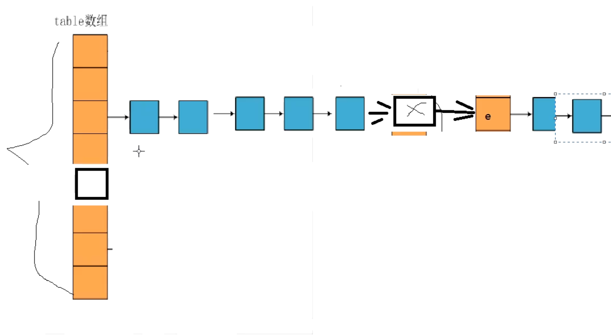
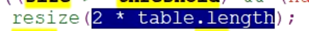

# 1、集合和数组的区别？
	- 集合用于封装对象（引用数据类型）；
	- 集合可以存放[[#red]]==**个数不确定的对象**==；
	- 集合可以存储[[#red]]==**不同数据类型的对象**==
- # 2、哪些集合是线程安全的？
	- 线程安全的有：Stack, HashTable, Vector（很少用，效率低）, Enumeration。
- # 3、fail-fast 是啥？
	- 多线程同时改变集合时的错误检测机制。
- # 4、怎么让集合不被修改？
	- Collections. unmodifiableCollection(Collection c) 创建只读集合。
- # 5、如何边遍历边删除集合内容？
	- 唯一方法：采用 Iterator 遍历，并用 Iterator.remove() 方法删除集合内容。
		- ```java
		  List arrayListA = new ArrayList<>();
		  Iterator it = arrayListA.iterator();
		  while(it.hasNext()){
		    it.remove();
		  }
		  
		  ```
- # 6、Collection 元素如何遍历？哪种最好？
	- for 循环遍历，迭代器遍历，foreach 遍历。
	- 性能方面
		- 不同的遍历方式可能会有一些差异，但通常情况下它们的**性能差异并不显著**，可以忽略不计。选择遍历方式时，更重要的**是考虑代码的可读性和简洁性**。
	- 效率方面
		- ==**增强型 for 循环是效率最高的选择。**==
		- **增强型 for 循环**在代码编写和可读性方面更加简洁
		- 增强型 for 循环在[[#red]]==**编译时会被转化为使用迭代器的方式**==来遍历集合。这意味着它在底层使用了与手动使用迭代器相同的机制，但简化了代码的书写。由于编译器会进行一些优化，增强型 for 循环通常比手动使用迭代器的方式稍微更高效。
- # 7、多线程情况下如何使用 ArrayList？
	- 可以通过 Collections.synchronizedList 方法，将 arrayListA 转换为线程安全的 arrayListB。
		- ```java
		  List arrayListB = Collections.synchronizedList(arrayListB);
		  ```
- # 8、hashCode 和 equals 方法有什么关系？
	- 8-1、[[#red]]==hashCode() 方法和 equals()== 方法在 Java 中[[#red]]==都用于处理对象的相等性==，但它们具有不同的作用和关系。
	- 8-2、[[#red]]==如果 equals相等，hashCode 一定相等。如果 hashCode 相等，不一定 equals相等。==
	- hashCode() 方法：
		- hashCode() 方法[[#red]]==用于计算对象的哈希码，返回一个整数值==。哈希码是根据对象的内容计算得出的，[[#red]]==理想情况下，不同的对象应该具有不同的哈希码。==
		- hashCode() 方法在集合类（如 HashMap、HashSet 等）中广泛用于快速定位对象。
		- hashCode() 方法必须满足的要求是：如果两个对象使用 equals() 方法判断相等，那么它们的 hashCode() 方法必须返回相同的值。
	- equals() 方法：
		- equals() 方法[[#red]]==用于比较两个对象是否相等，即对象的内容是否相同==。equals() 方法是 Object 类的方法，但它可以被子类重写以提供更准确的相等性判断逻辑。
		- equals() 方法必须满足的要求是：对称性（a.equals(b) 和 b.equals(a) 结果一致），自反性（a.equals(a) 返回 true），传递性（a.equals(b) 和 b.equals(c) 结果一致，则 a.equals(c) 结果一致），一致性（对象内容未改变时，多次调用 equals() 结果一致），非空性（对象非空时，equals(null) 返回 false）。
		- equals() 方法通常需要与 hashCode() 方法一起使用，以保持一致性。
- # 9、equals 和 == 又有什么关系？
	- [[#red]]==1、equals() 方法用于比较两个对象的内容是否相等，即逻辑上的相等性。==
	- [[#red]]==2、运算符用于比较两个对象的引用是否相等，即对象在内存中的地址是否相同==
	- 对于基本数据类型（如 int、boolean 等），== 运算符比较的是它们的值。
	- 对于引用类型（如对象），== 运算符比较的是它们的引用（地址）是否相同。
	- 在一些情况下，equals() 方法被重写，以便在逻辑上相等的对象被认为是相等的，即使它们的引用不同。
- # 10、[[使用LinkedList模拟堆栈和队列]]
- # 11、hashmap和hashTable的区别
	- HashMap
		- 线程不安全，没有锁，性能相对hashtable高些
		- 可以null键，null值
		- HashMap的初始容量为16
		- HashMap扩容时是当前容量翻倍即:capacity*2
	- HashTable
		- 线程安全，实现方法里面都添加了synchronized关键字来确保线程同步，所以性能相对低
		- 不允许null键，null值
		- Hashtable初始容量为11
		- Hashtable扩容时是容量翻倍+1即:capacity*2+1
- # 12、[[HashMap源码]]相关
	- ## 1、加载因子 0.75 为啥？
		- 有测试此时扩容性能最优
	- ## 3、某个点时效率最低？
		- 全部hash冲突成单链表了
		  collapsed:: true
			- 
	- ## 2、扩容的意义？
		- 避免冲突，冲突会性能低。扩容了长度大了取模得到的index冲突的几率就会变小
	- ## 3、扩容按多大扩容
		- 原长度的2倍
		  collapsed:: true
			- 
	- ## 4、扩容也是耗性能的
		- 每次扩容 需要重新计算原来元素的hash值 存入新表
	- ## 5、实际使用避免扩容，评估hashMap的大小
	- ## 3、默认的HashMap多大？
		- 2的4次幂= 16
		- 扩容阈值  = 0.75*16 = 12
	- ## 6、table数组初始化在哪里？
		- 第一次put时，使用时才初始化，节省内存
	- ## 7、长度为啥都是2的次幂？
		- 为了取模得到下标
	- ## 8、内存有25%的浪费，0.75时就扩容。以空间换时间
		- Android解决这个问题，节省空间，[[SparseArray]].双数组结构
		-
- # 13、[[LinkedHashMap]]怎么保证有序的原理
- # [集合面试题](https://mp.weixin.qq.com/s?__biz=MzkxMDI2NTc2OQ==&mid=2247485959&idx=1&sn=f20ee47bf82a5b436f2f6157bcc5798b)
- # [Java集合容器面试题（2020最新版）](https://blog.csdn.net/ThinkWon/article/details/104588551)