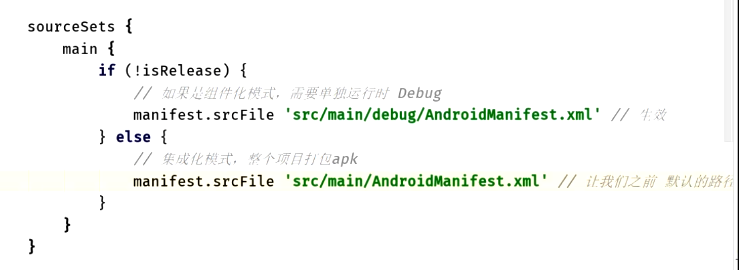

# 背景：测试期间组件独立运行，也可整体打包app壳运行
	- 
- # 一、提取gradle公共配置
  collapsed:: true
	- >因为：每个library模块都有一个Gradle文件，配置都是重复的
	- 1、根目录：新建derry.gradle 定义公共的配置：比如版本号什么的
	  collapsed:: true
		- ```groovy
		  // Groovy语言 面向对象 if  for
		  
		  // 扩展快
		  ext {
		  
		      // 现在 Gradle
		      // 正式环境 和 测试环境
		      isRelease = false
		  
		      // 正式环境 和 测试环境 服务器 URL 配置
		      url = [
		              "debug"  : "https://192.188.22.99/debug",
		              "release": "https://192.188.22.99/release"
		      ]
		  
		      // 建立Map存储，  key 和 value  都是自定义的
		      androidID = [
		              compileSdkVersion        : 30,
		              buildToolsVersion        : "30.0.1",
		  
		              applicationId            : "com.derry.derry",
		              minSdkVersion            : 16,
		              targetSdkVersion         : 30,
		              versionCode              : 1,
		              versionName              : "1.0",
		  
		              testInstrumentationRunner: "androidx.test.runner.AndroidJUnitRunner"
		      ]
		  
		      // 建立Map存储，  key 和 value  都是自定义的
		      appID = [
		              app: "com.derry.modularproject",
		              login: "com.derry.login",
		              register: "com.derry.register"
		      ]
		  
		      // 300 行  MAP  key  value
		      dependenciesID = [
		              "appcompat"       : "androidx.appcompat:appcompat:1.2.0",
		              "constraintlayout": "androidx.constraintlayout:constraintlayout:2.0.1",
		              "material"        : "com.google.android.material:material:1.1.0",
		              "vectordrawable"  : "androidx.vectordrawable:vectordrawable:1.1.0",
		              "fragment"        : "androidx.navigation:navigation-fragment:2.2.2",
		              "ui"              : "androidx.navigation:navigation-ui:2.2.2",
		              "extensions"      : "androidx.lifecycle:lifecycle-extensions:2.2.0",
		      ]
		  
		  }
		  ```
	- 2、在壳工程build.gradle里引用
		- ```java
		  // 根目录下的build.gradle 引入   公共的一份 引入过来
		  apply from : 'derry.gradle'
		  ```
	- 3、其他library 就可以使用了
		- ```java
		  apply plugin: 'com.android.library'
		  
		  println "Derry ---> lib Student hao 2"
		  // 完整的方式  性能优化，相当于一份缓存
		  def androidID = rootProject.ext.androidID
		  android {
		      compileSdkVersion androidID.compileSdkVersion
		      buildToolsVersion androidID.buildToolsVersion
		  
		      defaultConfig {
		          minSdkVersion androidID.minSdkVersion
		          targetSdkVersion androidID.targetSdkVersion
		          versionCode androidID.versionCode
		          versionName androidID.versionName
		  
		          testInstrumentationRunner "androidx.test.runner.AndroidJUnitRunner"
		      }
		  
		      buildTypes {
		          release {
		              minifyEnabled false
		              proguardFiles getDefaultProguardFile('proguard-android-optimize.txt'), 'proguard-rules.pro'
		          }
		      }
		  }
		  
		  dependencies {
		      implementation fileTree(dir: "libs", include: ["*.jar"])
		  
		      /*implementation "androidx.appcompat:appcompat:1.2.0"
		      implementation "androidx.constraintlayout:constraintlayout:2.0.1"
		      implementation "com.google.android.material:material:1.1.0"
		      implementation "androidx.vectordrawable:vectordrawable:1.1.0"
		      implementation "androidx.navigation:navigation-fragment:2.2.2"
		      implementation "androidx.navigation:navigation-ui:2.2.2"
		      implementation "androidx.lifecycle:lifecycle-extensions:2.2.0"*/
		  
		      // 一行搞定300行 循环搞定
		      dependenciesID.each {k,v -> implementation v}
		  
		      testImplementation 'junit:junit:4.12'
		      androidTestImplementation 'androidx.test.ext:junit:1.1.2'
		      androidTestImplementation 'androidx.test.espresso:espresso-core:3.3.0'
		  
		  }
		  ```
- # 二、模块独立运行
	- 
	-
- # 三、可以控制哪份清单文件生效
	- 
- # 四、屏蔽测试代码
	- 