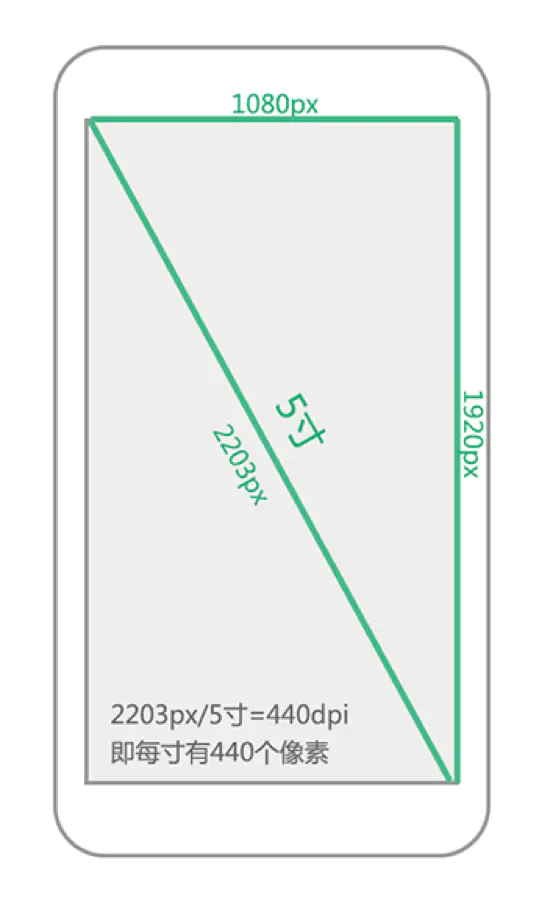
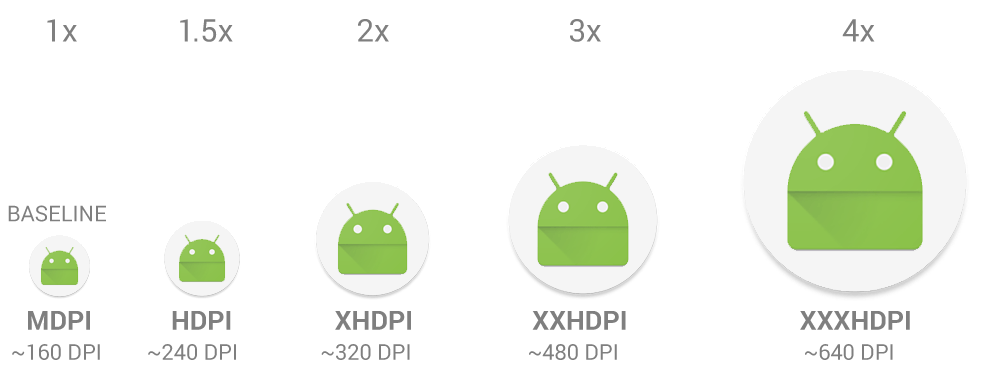

- 我们的项目中只保留drawable-xxhdpi一套超超高精度图片，确保大部分机型都可使用而不会模糊，因为我们调研了APP使用Top10以上的机型和近2年发布的新机型屏幕分辨率都在1080p以上，及少数在720p。提供一套xxhdpi的图片就可以满足业务需要，且不会有包大小的负担。
	- 
	-
- 屏幕像素密度(dpi)
  屏幕像素密度是指每英寸上的像素点数，单位是dpi，即“dot per inch”的缩写。屏幕像素密度与屏幕尺寸和屏幕分辨率有关，在单一变化条件下，屏幕尺寸越小、分辨率越高，像素密度越大，反之越小。假设1英寸上像素点为160个，那么该屏幕像素密度为160dpi,同理可知其余屏幕像素密度。
- 为简便起见，Android 将所有屏幕密度分组为六种通用密度： 低、中、高、超高、超超高和超超超高。
	- ldpi（低）~ 120dpi
	  mdpi（中）~ 160dpi
	  hdpi（高）~ 240dpi
	  xhdpi（超高）~ 320dpi
	  xxhdpi（超超高） ~ 480dpi
	  xxxhdpi（超超超高）~ 640dpi
- 屏幕适配
	- 
- 对于5种主流的像素密度(mdpi,hdpi,xhdpi,xxhdpi和xxxdpi)应按照2:3:4:6:8的比例进行缩放。例如一个启动图片ic_launcher.png,它在各个像素密度文件夹下大小为：
	- ldpi（低）36*36 (0.75x)
	  mdpi（中）48*48 (1x)
	  hdpi（高）72*72 (1.5x)
	  xhdpi（超高）96*96 (2x)
	  xxhdpi（超超高）144*144 (3x)
	  xxxhdpi（超超超高）192*192 (4x)
- Android SDK加载图片流程：
	- Android SDK会根据屏幕密度自动选择对应的资源文件进行渲染加载，比如说，SDK检测到你手机的分辨率是xhdpi，会优先到xhdpi文件夹下找对应的图片资源
	- 如果xhdpi文件夹下没有图片资源，那么就会去分辨率高的文件夹下查找，比如xxhdpi，直到找到同名图片资源，将它按比例缩小成xhpi图片
	- 如果往上查找图片还是没有找到，那么就会往低分辨率的文件夹查找，比如hdpi，直到找到同名图片资源，将它按比例放大成xhpi图片