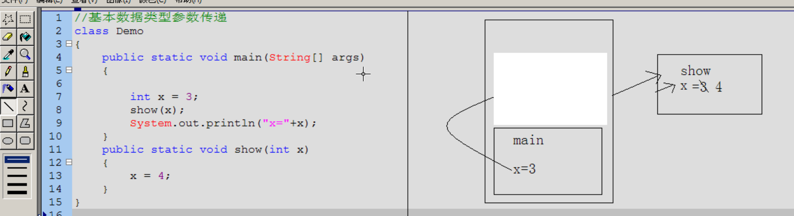

- # 一、类和对象的关系？
  collapsed:: true
	- 类：事物的描述
		- 比如动物类，定义身高颜色
	- 对象：该类事物的实例
		- 大象实体（1.8米。灰色）
- # 二、对象在内存中的体现
  collapsed:: true
	- -00_08_43-2023_06_14_15_57_31_1686729477810_0.jpg)
- # 三、成员变量和局部变量的区别
  collapsed:: true
	- {:height 393, :width 749}
- # 四、基本数据类型参数传递
  collapsed:: true
	- 
	- 1、main函数进栈，x= 3
	- 2、show函数进栈，传入3，赋值4，show运行完出栈，
	- 3、输出打印的还是主函数main的3.
	- [[#red]]==**最终输出3**==
- # 五、引用类型的数据传递
  collapsed:: true
	- 
	- 1、main入栈 d对象变量初始化，同时堆中开辟空间初始化d对象
	- 2、d对象x的默认值为3
	- 3、d.x=9   修改对象中的9
	- 4、show(d) show函数进栈，修改对象中的x = 4.然后show出栈。
	- [[#red]]==**5、输出的还是对象中的x = 4**==
- # 六、[[封装]]
- # 七、构造函数和一般函数的区别？
  collapsed:: true
	- ## 构造函数
		- 1、对象创建时，就会调用与之对应的构造函数，对对象进行初始化
		- 2、对象创建时，会调用且只调用一次
	- ## 一般函数
		- 1、对象创建后，需要函数功能时才调用
		- 2、对象创建后，可以被调用多次
- # 八、构造函数内存图解
  collapsed:: true
	- -00_07_01-2023_06_14_17_23_47_1686734651029_0.jpg)
- # 九、this关键字
  collapsed:: true
	- this：代表当前对象
		- this就是所在函数，所属对象的引用
	- ## 简单说
		- 哪个对象调用了this所在的函数，this就代表哪个对象
	- ## 作用
		- 1、当成员变量和局部变量重名时，可以用关键字this区分
- # 十、static关键字
  collapsed:: true
	- ## 静态变量内存：方法区
	  collapsed:: true
		- 静态变量通过`static`修饰符被存储在JVM的方法区（Method Area）或元空间（Metaspace）中。这些静态变量在类加载时被初始化，并且在整个程序的执行过程中一直存在。
		- 
	- ## 特点
	  collapsed:: true
		- 
	- ## 注意事项
	  collapsed:: true
		- 
	- ## 使用场景
	  collapsed:: true
		- 
	- ## 静态代码块
		- 随着类的加载而执行，而且只执行一次
		- ## 作用
			- 用于给类进行初始化
- # 十一、代码块对比
  collapsed:: true
	- ## 构造代码块
		- ## 定义：类中的独立代码块，叫构造代码块
			- ```java
			  
			  public class SortArray {
			      { // 构造代码块
			          Log.d("tag","");
			      }
			  }
			  ```
		- ## 作用：可以给所有对象进行初始化的
		- ## 执行时机：对象创建的时候执行
	- ## 静态代码块
		- ```java
		  
		  public class SortArray {
		      static { // 静态代码块
		          Log.d("tag","");
		      }
		  }
		  ```
		- ## 执行时机：随着类的加载而执行，而且只执行一次
		- ## 作用：用于给类进行初始化
	- ## 局部代码块
		- 作用：限定局部变量的生命周期
- # 十一、成员变量和静态变量的区别？
  collapsed:: true
	- 
- # 十二 、构造代码块，静态代码块，构造函数的区别
  collapsed:: true
	- 1、构造代码块：给所有对象初始化操作
	- 2、构造函数：可以传参给特定对象进制初始化（不同参数的构造函数）
	- 3、静态代码块：给类进行初始化操作
	- 执行顺序：
		- 类加载的时候——>执行静态代码块
		- 如果创建对象->执行构造代码块。没对象不会执行
		- 然后有对象构造函数
- ## [[Java_doc文档生成]]
- # 十三、面向对象的三大特性
	- ## [[封装]]
	- ## [[继承]]
	- ## [[多态]]
	- ## 字符类+构造代码块执行过程
		- 示例代码
		  collapsed:: true
			- ```java
			  ```
		- 
		- 1、上述代码中 执行new zi()，首先走到zi构造函数
		- 2、zi构造函数默认调用super() ，执行父类的构造函数
			- ```java
			  fu contructor run
			  ```
		- 3、然后执行show()方法 发现子类 复写，调用子类的show方法，同时子类的num成员还没初始化
		  collapsed:: true
			- ```
			  show 0
			  ```
		- 4、super（）执行完 进行成员的显示初始化  num =9
		- 5、执行构造代码块初始化
			- ```java
			  constructor code 9
			  num = 10
			  ```
		- 6、然后才是
			- ```java
			  zi  contructor....10
			  ```
- # 十四、[[内部类]]
- # 十五、[[object、equals、hashcode、toString]]
	-
-