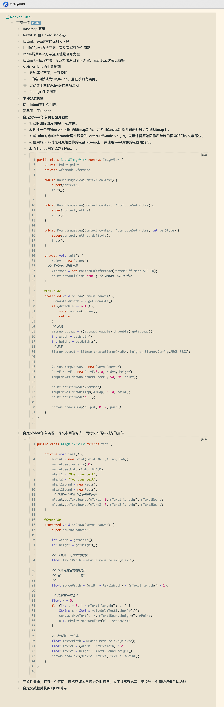

- # Java
	- ## [[java面试题]]
	- ## [[线程池面试题]]
	- ##  [[多线程面试题]]
	  collapsed:: true
	- ## 字符串
		- ## [[字符串内存上的面试题]]
		- [[#red]]==两个String对象用"+"拼接会被优化为StringBuffer的append拼接，然后toString方法，与new一样会直接在堆中创建对象。==
	- ## [[包装类面试题]]
	- ## [[序列化面试题]]
	- ## [[JVM虚拟机面试题]]+GC
	- ## [[泛型面试题]]
	- ## [[设计模式面试题]]
	- ## [[集合面试题]]
	- ## [[注解与反射面试题]]
- # Kotlin
	- 协程
	- 内联函数
- # Android
  collapsed:: true
	- ## [[Activity面试题]]
	- ## [[Fragment面试题]]
	- # 性能优化
		- 包大小
		- 启动速度
		- 数据结构优化
		- OOM与内存优化（内存泄漏与监控）
		- 卡顿和布局优化
		- 电量与网络优化
		- ANR分析
	- # AOP
		- APT
		- ASM
		-
	- ## 源码相关
	  collapsed:: true
		- ## [[OKhttp面试题]]
		- ## [[Retrofit面试题]]
		- 线程池
			- [[线程池源码分析]]
		- Arouter
		  collapsed:: true
			- [[arouter分组 寻址]]
			- [[Arouter自动注册解析]]
		- [[Databinding]]
		- [[lifecycle源码分析]]
		- [[浅析Android消息总线]]
		- [[SP]]
	- ## [[handler消息机制面试题]]
	- ## [[Android中的多线程]]
	- ## [[Binder机制面试题]]
	- ## [[AIDL面试题]]
	- ## [[安卓系统面试题]]
	- ## SystemServer面试题
		- ## [[AMS面试题]]
		- ## [[WMS面试题]]
		- ## [[PKMS面试题]]
		  collapsed:: true
	- ## [[Android虚拟机和ClassLoad面试题]]
	- view
		- 事件分发
		- 自定义view
	- [[jetpack]]
	- 图片加载框架对比，缓存对比，Glide用了什么设计模式
		- [[fresco]]
- # [[算法]]
- # 跨平台
  collapsed:: true
	- RN
	- Flutter
	- Hybrid
- # [[网络]]
- [[Hook相关]]
- ## [2021真实面试题](https://blog.csdn.net/xuwb123xuwb/article/details/115871985)
  collapsed:: true
- ## [2021简历对应面试文档](https://blog.csdn.net/xuwb123xuwb/article/details/115667889)
- # 面试题真题
	- 
	- [21年面试题](https://thinkwon.blog.csdn.net/article/details/120928777)
	- [23年美团面经](https://segmentfault.com/a/1190000043759791)
	- 
	- 
	- 
	- 
	- 
	- 