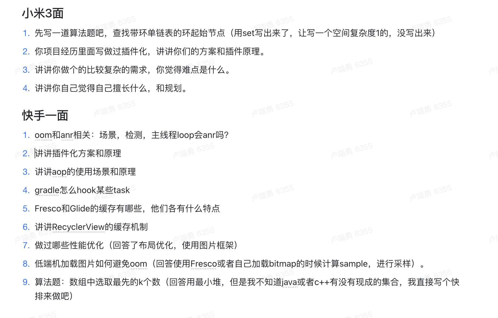
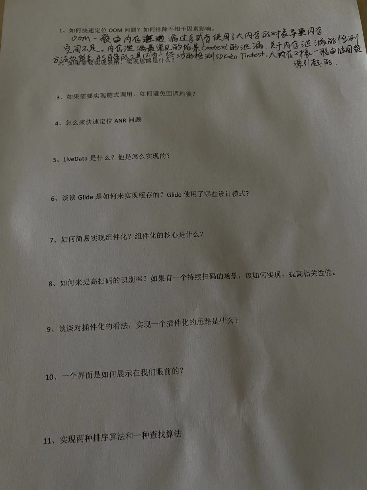
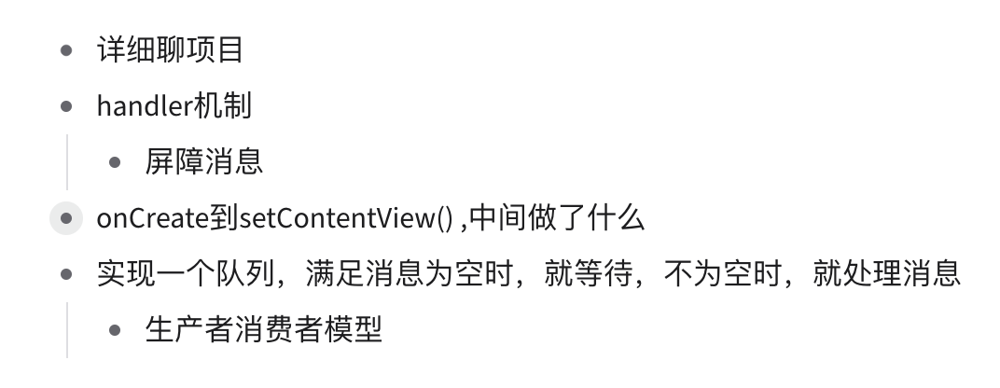
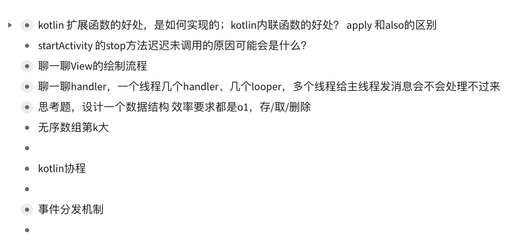
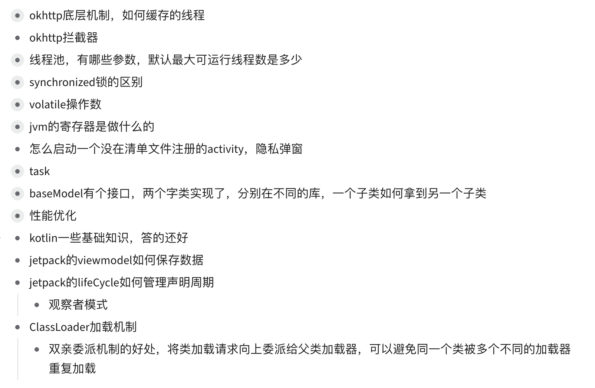
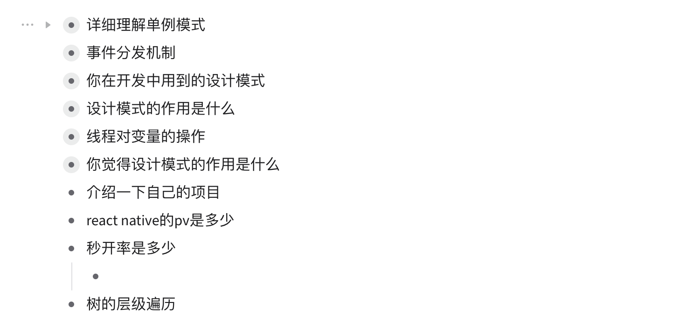

- java基础
	- 线程池
	- 字符串
	  collapsed:: true
		- [[字符串内存上的面试题]]
		- [[#red]]==两个String对象用"+"拼接会被优化为StringBuffer的append拼接，然后toString方法，与new一样会直接在堆中创建对象。==
	- [[包装类面试题]]
- android
  collapsed:: true
	- AOP
	  collapsed:: true
		- APT
		- ASM
		-
	- 源码相关
		- okhttp源码
			- [[OkHttp线程池相关源码分析]]
			- [[五大拦截器]]
		- retrofit源码
			- [[retrofit源码分析]]
		- 线程池
			- [[线程池源码分析]]
		- Arouter
			- [[arouter分组 寻址]]
			- [[Arouter自动注册解析]]
		- [[Databinding]]
		- [[lifecycle源码分析]]
		- [[浅析Android消息总线]]
		- [[SP]]
	- handler
		- [Handler中的奇奇怪怪](https://www.mdnice.com/writing/677e19d9e5904340be7304a73c615f59)
	- view
	  collapsed:: true
		- 事件分发
		- 自定义view
	- [[jetpack]]
	- 图片加载框架对比，缓存对比，Glide用了什么设计模式
		- [[fresco]]
- [[算法]]
- 跨平台
  collapsed:: true
	- RN
	- Flutter
	- Hybrid
- [[网络]]
- [[Hook相关]]
- 面试题
	- 
	- [21年面试题](https://thinkwon.blog.csdn.net/article/details/120928777)
	- [23年美团面经](https://segmentfault.com/a/1190000043759791)
	- 
	- 
	- 
	- 
	- 