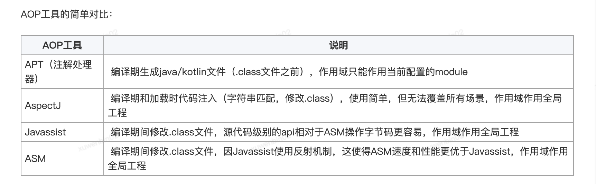
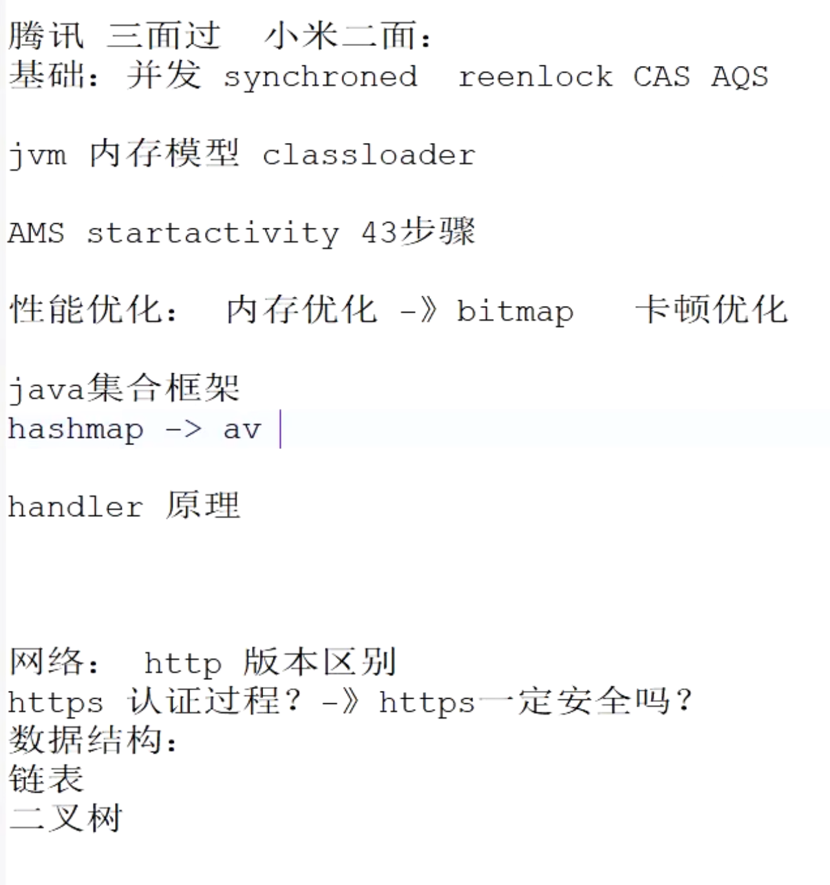

# Java
	- ## [[java基础面试题]]
	- ## [[JVM虚拟机面试题]]+GC
	- ## [[字符串内存上的面试题]]
	- ## [[包装类面试题]]
	- ## [[线程池面试题]]
	- ##  [[多线程面试题]]
	  collapsed:: true
		- 熟悉java多线程编程与线程池工作流程
		- 熟悉volatile关键字、synchronized、Lock等同步锁的使用
		- 了解CAS机制，synchronized实现原理与优化
		- AQS队列同步器原理-》CLH队列锁思想
	- ## [[序列化面试题]]
	- ## [[泛型面试题]]
	- ## [[设计模式面试题]]
	- ## [[集合面试题]]
	- ## [[注解与反射面试题]]
	- # [Java面试总结（2021优化版）](https://thinkwon.blog.csdn.net/article/details/120928777)
	- # [Java基础知识面试题（2020最新版）](https://thinkwon.blog.csdn.net/article/details/104390612)
	- # [美团面经总结（2023最新）](https://segmentfault.com/a/1190000043759791)
- # Kotlin
  collapsed:: true
	- ## [[kotlin面试题]]
	- ## [[协程面试题]]
	- 内联函数
- # Android
	- ## [[Activity面试题]]
	- ## [[Fragment面试题]]
	- ## [[Service面试题]]
	- ## [[Application面试题]]
	- # 基础知识
		- ## [[Android工程文件下res文件夹与assets文件夹的区别]]
		- ## [[动画面试]]
	- # 组件化-插件化-模块化
	  collapsed:: true
		- ## [[插件化面试题]]
		- ## [[APP架构设计-模块化-组件化-插件化-面试]]
	- # 开发架构
		- ## [[开发架构Mvx面试题]]mvc,mvp,mvvm
	- # 性能优化
	  collapsed:: true
		- ## 数据结构优化：
		  collapsed:: true
			- 各个数据结构的特点选择合适的场景
			- Arraylist,内部数组，查询快增删慢
			- LinkedList，内部链表，增删快查询慢
			- HashMap为了避免扩容带来的性能损耗。可以考虑SparseArray ArrayMap等
		- ## [[内存优化：OOM+内存泄漏-面试]]
		- ## [[启动优化-面试]]
		- ## [[卡顿分析与布局优化-面试]]
		- ## [[ANR面试题]]
		- ## [[包大小优化-面试]]
		- ## [[屏幕适配面试]]
	- # AOP
	  collapsed:: true
		- ## [[APT-面试]]-APT自动生成接口包装类，Arouter生成路由表
		- ## ASM
			- ## 场景
				- Arouter自动注册，我们使用的话也可以效仿统一日志库自动注册模块 多个TAG。初始化时统一输出
				- 自动补全log上下文
		- ## AOP工具对比
			- 
	- # 源码相关
		- ## [[OKhttp面试题]]
		- ## [[Retrofit面试题]]
		- ## [[Rxjava面试题]]
		- ## [[SP面试题]]
		- ##  [[Arouter-面试]]
	- ## [[handler消息机制面试题]]
	- ## [[Android中的多线程]]
	- ## [[Binder机制面试题]]
	- ## [[AIDL面试题]]
	- ## [[安卓系统面试题]]
	- # SystemServer面试题
		- ## [[AMS面试题]]
		- ## [[WMS面试题]]
		- ## [[PKMS面试题]]
		  collapsed:: true
	- ## [[Android虚拟机和ClassLoad面试题]]
	- # View
		- ## [[事件分发-面试题]]
		- ## [[自定义View面试题]]
		- ## [[RecyclerVIew-面试题]]
		- ## [[ViewPager面试题]]
	- # Jetpack
		- ## [[Lifecycle-面试题]]
		- ## [[Livedata-面试题]]
		- ## [[DataBinding-面试]]
		- ## [[Room-面试题]]
		- ## [[ViewModel-面试]]
		- ## [[Navigation-面试]]
		- ##  [[WorkManager-面试]]
	- # 图片加载框架对比
		- ## [[fresco]]
		- # [[Fresco-面试]]
		- ## [[Glide-面试]]
			- 了解Glide感知生命周期原理与缓存机制
- # [[算法]]
- # 跨平台
	- RN
	- Flutter
	- ## [[WebView面试题]]
- # [[网络面试题]]
- # [[Hook相关]]
- # [[Gradle-面试]]
- # [[手写代码-面试]]
- # 讲讲你做的比较难的需求，你觉得难点在哪
  collapsed:: true
	- 我觉得比较难的就是开发一个公共库，让RD用着爽，这个不断改进的过程比较难
	-
	- 58同城app里包含多套日志库，格式不统一，缺乏关键信息等。我们开发了统一标准日志库，
	- 当时log的上下文比如method和class 是 统一日志库自动补全的
	- 当时已有通过transform+ASM修改字节码能力，日志信息字符串检测。就是线上环境不允许log有字符串拼接
	- 想着也用ASM自动补全调用日志上下文。但是有个判断标准。当时定好了一个标准后比如继承某个类。就可以按这个过滤到调用点。生成字节码自动填充。因为这个是编译期处理的。运行时不会耗性能。但是评审时。大家对新事物都具有抵抗心理。api都想顺应Log.d, log.i  这种使用习惯。考虑到已经开发好结构，只好外边包装一层
	- 包装的话。ASM找通用标准判断log调用位置就不好处理。最终还是选择了运行时获取堆栈信息去填充上下文了。好在填充上下文信息只有debug 环境下使用
- # 讲讲你觉得自己擅长什么，规划是什么
  collapsed:: true
	- ## 擅长什么？
		- 1、应用开发上，我对Android的UI设计、性能优化和用户体验有很好的理解。我熟悉使用Java/Kotlin进行开发，也对常见的Android架构模式如MVC、MVP、MVVM很熟悉。
		- 2、有良好的沟通能力，能和不同部门紧密合作，快速理解不同团队的需求
		- 3、会不断学习新技术，比较强的抗压和适应能力
	- ## 规划
		- 1、还是先不断拓宽自己的技术栈
		- 2、最终还是想不断晋升的
- # [[项目介绍-面试]]
- # 真题
  collapsed:: true
	- ## 网上面试题
		- [Android面试题——高级开发面试题一](https://blog.csdn.net/Calvin_zhou/article/details/128123302)
	- 
	- ## [2021真实面试题](https://blog.csdn.net/xuwb123xuwb/article/details/115871985)
	- ## [2021简历对应面试文档](https://blog.csdn.net/xuwb123xuwb/article/details/115667889)
	- # 面试题真题
		- 
		- [21年面试题](https://thinkwon.blog.csdn.net/article/details/120928777)
		- [23年美团面经](https://segmentfault.com/a/1190000043759791)
		- 
		- 
		- 
		- 
		- 
		- {:height 2369, :width 749}